# Q-Learning-Maze-Game
This reinforcement learning project is centered around an agent navigating an 8x8 grid environment while learning through Q-learning. 

Advance Machine Learning Project by:
- Amor, Mark Robert
- Reyes, Jan Vincenzo
- Servando, Rabindranht
- Tan, Earl Lanz Cristien
- Ventura, Francesca

## Reinforcement Learning

This reinforcement learning project is centered around an agent navigating an 8x8 grid environment while learning through Q-learning. The system incorporates interactive elements (Enemies from a video game), visual feedbacks, and user interactivity  to enhance both functionality and interpretability.

To guide you with the step-by-step process, let us first begin by importing all necessary libraries.

The project will not be using custom environment libraries, instead, the environment will be set up through manual code, visualized with pygame.


```python
import platform
import numpy as np
import pygame
import time
import matplotlib.pyplot as plt
import os
from IPython.display import Image, display
```


```python
import os
import urllib.request

image_urls = {
    "image8.jpg": "https://raw.githubusercontent.com/Lanzero225/Q-Learning-Maze-Game/refs/heads/main/content/image8.jpg",
    "image1.jpg": "https://raw.githubusercontent.com/Lanzero225/Q-Learning-Maze-Game/refs/heads/main/content/image1.jpg",
    "image2.jpg": "https://raw.githubusercontent.com/Lanzero225/Q-Learning-Maze-Game/refs/heads/main/content/image2.jpg",
    "image3.jpg": "https://raw.githubusercontent.com/Lanzero225/Q-Learning-Maze-Game/refs/heads/main/content/image3.jpg",
    "image4.jpg": "https://raw.githubusercontent.com/Lanzero225/Q-Learning-Maze-Game/refs/heads/main/content/image4.jpg",
    "image5.jpg": "https://raw.githubusercontent.com/Lanzero225/Q-Learning-Maze-Game/refs/heads/main/content/image5.jpg",
    "image6.jpg": "https://raw.githubusercontent.com/Lanzero225/Q-Learning-Maze-Game/refs/heads/main/content/image6.jpg",
    "image7.jpg": "https://raw.githubusercontent.com/Lanzero225/Q-Learning-Maze-Game/refs/heads/main/content/image7.jpg",
    "image9.jpg": "https://raw.githubusercontent.com/Lanzero225/Q-Learning-Maze-Game/refs/heads/main/content/image9.jpg"


}

os.makedirs("images", exist_ok=True)

for filename, url in image_urls.items():
    urllib.request.urlretrieve(url, os.path.join("images", filename))
```

After a successful run, it is time for the main ingredients of the program.

### Ref1 - Design a Custom Maze Environment

#### __ __init__ __
Below is the main class setting up the MazeEnv class, which will be where all the initialization and methods related to the environment are set up.

Inizialization starts off with developing a grid 2d-array (8 by 8 size) with a starting (S) cell, walls (W), pathways (.), traps (T), portals (P1 and P2), a reward (R), and the goal (G).

It is also indicated the different actions:
* Left - 0
* Right - 1
* Up - 2
* Down - 3

Additionally, the images are also loaded in with PyGame.

After initialization, there are more core functions for interacting with the maze environment:

#### reset():

This method resets the environment to its initial state.

#### _get_state_id(self):
This is simply a helper method to convert the agent's 2D state coordinates (row, column) into a single unique integer ID.

#### step(self, action):

This is the main function for the agent to take action. It takes an action as input and updates the environment's state accordingly. It calculates the new_x and new_y coordinates based on the current state and the chosen action.
* Portal Logic: If the new position is a portal ('P1' or 'P2'), the agent's state is updated to the corresponding portal's destination.
* If the new position is not a wall ('W'), the agent's state is updated, and the new state is added to the self.path.
* It determines the reward based on the cell type of the new state:
  - 10 for reaching the goal ('G').
  - 5 for reaching the reward ('R').
  - -1 for landing on a trap ('T').
  - 0 for moving to an empty cell or a portal.

### Ref4 - Add traps with negative rewards

Inside the step function, there are penalties and rewards added to the reward variable. To implement the reference, traps were scattered in the form of monsters in the environment. This will penalize the agent.

The traps can also be seen indicated in the grid 2d-array.

### Ref9 - Add portals

To add more variability, the group added 2 portals in the environment which can be seen in the initialization. In the step function, it is indicated that entering one portal will lead you to the other and vice versa.

### Ref8 - Visualize Environment

#### render

To introduce real-time visualization, the render method was added, showing the environment in a PyGame display. This fills the screen with a white background, iterates through the grid, and drawing the appropriate image for each cell based on its type (wall, empty, reward, goal, portal, or penalty). It also handles displaying the player's position as well as their path, indicated by the drawn blue lines.

#### save_step_maze

This method generates and saves a static image of the maze state at a specific step, which can be shown in the current Colab environment files. It creates a Pygame Surface which acts as an off-screen drawing area, draws the maze's current status, and saves the content of the surface as a JPEG image using pygame.image.save().

#### save_initial_maze

This is a helper method to specifically save the initial state of the maze at the beginning of an episode or run.


```python
# Ref1_v2: Custom maze environment
class MazeEnv:
    def __init__(self):
        # Ref1_v2: Define 8x8 grid with start, goal, reward, walls, and penalties
        print("Verbose: Initializing 8x8 maze environment")
        self.grid = [
            ['S', '.', '.', 'W', 'T', '.', '.', '.'],
            ['W', 'W', '.', 'W', '.', 'T', '.', '.'],
            ['.', '.', '.', '.', '.', '.', 'T', '.'],
            ['.', 'W', 'W', 'W', '.', '.', '.', '.'],
            ['.', 'P1', 'T', '.', 'W', '.', 'T', '.'],
            ['.', '.', '.', '.', '.', 'W', '.', '.'],
            ['T', 'W', '.', 'T', '.', '.', '.', 'R'],
            ['.', '.', '.', '.', 'W', 'P2', 'G', '.']
        ]
        #Row x col
        self.grid_size = 8
        self.state = (0, 0)  # Start position
        self.goal_state = (7, 6)  # Goal position
        self.reward_state = (6, 7)  # Reward position
        self.action_space = [0, 1, 2, 3]  # Left, Right, Up, Down
        self.cell_size = 64  # 64x64 pixels per cell for 512x512 total
        self.path = [(0, 0)]  # Track path history
        self.step_count = 0  # Track steps for static image naming

        # Ref1_v2: Load custom images for visualization
        try:
            self.images = {
              'S': pygame.image.load(os.path.join("images", "image8.jpg")),  # Player
              'R': pygame.image.load(os.path.join("images", "image1.jpg")),  # Reward
              'G': pygame.image.load(os.path.join("images", "image2.jpg")),  # Goal
              '.': pygame.Surface((64, 64)),         # Empty
              'W': pygame.Surface((64, 64)),          # Wall

              # Ref9: Portal
              'P1': pygame.image.load(os.path.join("images", "image9.jpg")),   # Portal
              'P2': pygame.image.load(os.path.join("images", "image9.jpg"))   # Portal
            }
            self.images['.'].fill((255, 255, 255))  # White empty
            self.images['W'].fill((0, 0, 0))        # Black wall
            print("Verbose: Loaded player (image8.jpg), reward (image1.jpg), goal (image2.jpg), empty, and wall images")
            self.penalty_images = [
                pygame.image.load(os.path.join("images", "image3.jpg")),
                pygame.image.load(os.path.join("images", "image4.jpg")),
                pygame.image.load(os.path.join("images", "image5.jpg")),
                pygame.image.load(os.path.join("images", "image6.jpg")),
                pygame.image.load(os.path.join("images", "image7.jpg"))
              ]
            print("Verbose: Loaded penalty images (image3.jpg to image7.jpg)")
        except FileNotFoundError as e:
            print(f"Verbose: Error loading images: {e}")
            raise
        for key in self.images:
            self.images[key] = pygame.transform.scale(self.images[key], (64, 64))
        for i in range(len(self.penalty_images)):
            self.penalty_images[i] = pygame.transform.scale(self.penalty_images[i], (64, 64))
        self.penalty_map = {}
        penalty_count = 0
        for i in range(self.grid_size):
            for j in range(self.grid_size):
                if self.grid[i][j] == 'T':
                    self.penalty_map[(i, j)] = self.penalty_images[penalty_count % 5]
                    penalty_count += 1
        print("Verbose: Images loaded and mapped for penalty tiles: (0,4)=image3.jpg, (1,5)=image4.jpg, (2,6)=image5.jpg, (4,2)=image6.jpg, (4,6)=image7.jpg, (5,0)=image3.jpg")

    # Ref1_v2: Reset environment to start state
    def reset(self):
        print("Verbose: Resetting environment")
        self.state = (0, 0)
        self.path = [(0, 0)]
        self.step_count = 0
        return self._get_state_id()

    # Ref1_v2: Convert state coordinates to ID
    def _get_state_id(self):
        return self.state[0] * self.grid_size + self.state[1]

    # Ref1_v2, Ref4: Step function with movement and reward logic (including penalties)
    def step(self, action):
        self.step_count += 1
        x, y = self.state
        new_x, new_y = x, y
        if action == 0: new_y -= 1  # Left
        elif action == 1: new_y += 1  # Right
        elif action == 2: new_x -= 1  # Up
        elif action == 3: new_x += 1  # Down

        reward = 0
        done = False
        if 0 <= new_x < self.grid_size and 0 <= new_y < self.grid_size:
              # Ref9: Portal
            if self.grid[new_x][new_y] == 'P1': # Portal going to Portal 2
                new_x, new_y = (7, 5)
            elif self.grid[new_x][new_y] == 'P2': # Portal going to Portal 1
                new_x, new_y = (4, 1)


            if self.grid[new_x][new_y] != 'W':
                self.state = (new_x, new_y)
                self.path.append(self.state)

        cell = self.grid[self.state[0]][self.state[1]]
        if self.state == self.goal_state:
            reward = 10
            done = True
        elif self.state == self.reward_state:
            reward = 5
        elif cell == 'T':
            reward = -1  # Ref4: Uniform penalty rewar


        return self._get_state_id(), reward, done, {}, {}

    # Ref8: Pygame Visualization of Path Taken
    def render(self, screen, mode="training", episode=0):
        print(f"Verbose: Rendering maze with custom images in Pygame window (mode: {mode}, episode: {episode}, step: {self.step_count})")
        screen.fill((255, 255, 255))
        for i in range(self.grid_size):
            for j in range(self.grid_size):
                cell_type = self.grid[i][j]
                if (i, j) == self.state and cell_type != 'S':
                    cell_type = 'S'
                if cell_type == 'T':
                    screen.blit(self.penalty_map[(i, j)], (j * self.cell_size, i * self.cell_size))
                else:
                    screen.blit(self.images[cell_type], (j * self.cell_size, i * self.cell_size))
        for i in range(len(self.path) - 1):
            x1, y1 = self.path[i]
            x2, y2 = self.path[i + 1]
            pygame.draw.line(screen, (0, 0, 255),
                           (y1 * self.cell_size + self.cell_size // 2,
                            x1 * self.cell_size + self.cell_size // 2),
                           (y2 * self.cell_size + self.cell_size // 2,
                            x2 * self.cell_size + self.cell_size // 2), 8)
        pygame.display.update()
        print(f"Verbose: Pygame display updated (mode: {mode}, episode: {episode}, step: {self.step_count})")
        self.save_step_maze(mode, episode)

    def save_step_maze(self, mode="training", episode=0, filename=None):
        if filename is None:
            filename = f"maze_step_{episode}_{self.step_count}.jpg"
        print(f"Verbose: Generating static maze visualization as {filename}")
        surface = pygame.Surface((512, 512))
        surface.fill((255, 255, 255))
        for i in range(self.grid_size):
            for j in range(self.grid_size):
                cell_type = self.grid[i][j]
                if (i, j) == self.state and cell_type != 'S':
                    cell_type = 'S'
                if cell_type == 'T':
                    surface.blit(self.penalty_map[(i, j)], (j * self.cell_size, i * self.cell_size))
                else:
                    surface.blit(self.images[cell_type], (j * self.cell_size, i * self.cell_size))
        for i in range(len(self.path) - 1):
            x1, y1 = self.path[i]
            x2, y2 = self.path[i + 1]
            pygame.draw.line(surface, (0, 0, 255),
                           (y1 * self.cell_size + self.cell_size // 2,
                            x1 * self.cell_size + self.cell_size // 2),
                           (y2 * self.cell_size + self.cell_size // 2,
                            x2 * self.cell_size + self.cell_size // 2), 8)
        try:
            pygame.image.save(surface, filename)
            print(f"Verbose: Static maze saved as {filename} in {os.getcwd()}")
            if platform.system() != "Emscripten" and Image and display:
                try:
                    display(Image(filename))
                    print(f"Verbose: Displaying static maze {filename} in Jupyter")
                except Exception as e:
                    print(f"Verbose: Failed to display static maze {filename} in Jupyter: {e}")
                    print(f"Verbose: Please check {filename} in {os.getcwd()}")
            else:
                print(f"Verbose: Please check {filename} in {os.getcwd()}")
        except Exception as e:
            print(f"Verbose: Failed to save static maze {filename}: {e}")

    def save_initial_maze(self, filename="initial_maze.jpg"):
        print(f"Verbose: Generating initial static maze visualization as {filename}")
        self.step_count = 0
        self.save_step_maze(mode="initial", episode=0, filename=filename)
```

### Ref5: Key Metrics for Q-Learning performance

Below are the initial variables set before Q-Learning begins. This simply initializes all the variables to use at the start. Additionally, empty lists below were declared and will be populated, these are the metrics for Q-learning including:
* Average Reward per Episode.
* Episode Length.
* Cumulative Reward.
* Success Rate
* Epsilon Decay


```python
# Ref5: Q-learning setup with epsilon decay and performance metrics
state_size = 64
action_size = 4
q_table = np.zeros((state_size, action_size))
alpha = 0.8
gamma = 0.95
epsilon = 1.0
epsilon_min = 0.01
epsilon_decay = 0.995
episodes = 100
FPS = 120

epsilons = []
rewards = []
successes = 0
q_changes = []
prev_q_table = q_table.copy()
average_reward_per_episode = []
success_rate = []
episode_lengths = []
```

The code below simply initializes the pygame display when it comes to training the Q-Learning model.


```python
# Pygame setup
print("Verbose: Initializing Pygame")
try:
    pygame.init()
    screen = pygame.display.set_mode((512, 512))
    pygame.display.set_caption("Maze Visualization")
    print("Verbose: Pygame window created (512x512 pixels)")
except Exception as e:
    print(f"Verbose: Failed to initialize Pygame: {e}")
    raise
```

    Verbose: Initializing Pygame
    Verbose: Pygame window created (512x512 pixels)
    

### Ref10: Replay function using saved actions

The function below adds a replay feature that records sequences of user or agent actions and allows them to be replayed visually. It will essentially just run the entire code taking in the user input in the next few cells.


```python
# Ref10: Replay function using saved actions
action_list = []
def replay_maze(actions_list):
    print("Verbose: Entering replay_maze function")
    state = env.reset()
    done = False
    replay_step_count = 0
    print("Verbose: Starting replay...")

    env.save_step_maze(mode="replay", episode=0, filename="maze_replay_start.jpg")

    for action in actions_list:
        if done:
            print("Verbose: Replay reached a terminal state. Stopping replay.")
            break
        next_state, reward, done, _, _ = env.step(action)
        state = next_state
        replay_step_count += 1
        env.save_step_maze(mode="replay", episode=0, filename=f"maze_replay_step_{replay_step_count}.jpg")
        print(f"Verbose: Replay step {replay_step_count}, action: {action}, state: {state}, reward: {reward}, done: {done}")

    print("Verbose: Replay completed.")
```

For the next big ingredient, it will be the driver function. We must first setup the environment, creating a variable env.

### Ref2: Epsilon Decay

Located near the end of the for loop of episodes is the code logic for epsilon decay, which takes the larger value between the default epsilon, and the one applied with decay to update the value. This reduces epsilon over time, but never lets it fall below the minimum epsilon. It ensures that the agent gradually shifts from exploring the environment to exploiting what it has already learned.

### Ref5: Key Metrics

WIthin the function of main, there are append statements which populate the metrics defined earlier. This will be used to track the Q-learning performance over the episodes.

### Ref 7: How to test the model with user input

After the training is done (The for loop), the next step is the while loop, which allows the user to interact with the environment, in a way playing with it as well. They can move, get rewards, get trapped, enter portals, and will finish once they enter the goal cell.


```python
def setup():
    global env
    print("Verbose: Setting up environment")
    env = MazeEnv()
    env.save_initial_maze()

# Ref2, Ref7_v1: Main training and testing loop (Ref3, Ref6 disabled)
def main():
    global epsilon, epsilons, rewards, episode_lengths, average_reward_per_episode, success_rate, successes, q_changes, prev_q_table, q_table, action_list
    print("Verbose: Entering main function")
    print("Verbose: Starting training")
    # Ref2, Ref5: Q-learning training with epsilon decay and metrics
    for episode in range(episodes):
        print(f"Verbose: Starting episode {episode + 1}/{episodes}")
        state = env.reset()
        done = False
        total_reward = 0
        steps = 0
        while not done:
            # Ref2: Epsilon-greedy action selection
            if np.random.rand() < epsilon:
                action = np.random.choice(env.action_space)
            else:
                action = np.argmax(q_table[state])
            next_state, reward, done, _, _ = env.step(action)
            q_table[state, action] += alpha * (
                reward + gamma * np.max(q_table[next_state]) - q_table[state, action]
            )
            state = next_state
            total_reward += reward
            steps += 1
            # *** FIX: COMMENT OUT PYGAME DISPLAY RENDER CALL ***
            #env.render(screen, mode="training", episode=episode + 1)
            #time.sleep(1.0 / FPS) # Sleep is also for live display
            # *** Consider adding env.save_step_maze() here if you want to save every single step visualization during training ***
            #env.save_step_maze(mode="training", episode=episode + 1) # Uncomment if you want to save every step

        # Ref5: Track performance metrics
        epsilons.append(epsilon)
        rewards.append(total_reward)
        average_reward_per_episode.append(total_reward / steps)

        success_rate.append(successes / (episode + 1))
        episode_lengths.append(steps)
        if total_reward >= 10:  # Success if goal reached
            successes += 1
        q_changes.append(np.linalg.norm(q_table - prev_q_table))
        prev_q_table = q_table.copy()
        # Ref2: Decay epsilon
        epsilon = max(epsilon_min, epsilon * epsilon_decay)
        print(f"Verbose: Episode {episode + 1} completed, total reward: {total_reward}, steps: {steps}")
        # *** FIX: Save the final state of the episode after training ***
        env.save_step_maze(mode="training_final", episode=episode + 1, filename=f"maze_episode_final_{episode + 1}.jpg")


    print("Verbose: Training completed")

    # Ref7_v1: Manual testing mode
    print("Verbose: Starting manual testing mode")
    state = env.reset()
    done = False
    print("Manual testing started. Choose actions:")

    # *** FIX: Save the initial state for manual testing ***
    env.save_step_maze(mode="manual", episode=0, filename="maze_manual_start.jpg")

    manual_step_count = 0
    while not done:
        # *** FIX: COMMENT OUT PYGAME DISPLAY RENDER CALL ***
       # env.render(screen, mode="manual", episode=0)
        try:
            print("Enter action (0=Left, 1=Right, 2=Up, 3=Down, or -1 to exit):")
            user_input = input()
            user_action = int(user_input)
            if user_action == -1:
                print("Verbose: Exiting manual testing")
                break
            if user_action not in [0, 1, 2, 3]:
                print("Verbose: Invalid action. Please enter 0 to 3.")
                continue
        except ValueError:
            print("Verbose: Invalid input. Please enter an integer.")
            continue

        next_state, reward, done, _, _ = env.step(user_action)
        print(f"Verbose: Moved to state {next_state}, reward: {reward}, done: {done}")
        action_list.append(user_action)
        state = next_state
        # *** FIX: Save the state after each manual step ***
        manual_step_count += 1
        env.save_step_maze(mode="manual", episode=0, filename=f"maze_manual_step_{manual_step_count}.jpg")
        #time.sleep(1.0 / FPS) # Sleep is for live display, not needed for static save

    print("Verbose: Manual testing completed")
```

Below is the driver code that calls the setup and training process. To make sure the program runs without errors, we implemented exception handling to catch these errors. As seen below, a bunch of images showing the agent's path throughout the episodes are displayed.

At the very end, the Q-Learning finishes, and we essentially get to play!


```python
try:
    print("Verbose: Starting execution")
    if platform.system() == "Emscripten":
        print("Verbose: Running in Pyodide environment (note: image loading and file saving may fail)")
    else:
        print("Verbose: Running in local environment")
    setup()
    main()
except Exception as e:
    print(f"Verbose: Execution failed with error: {e}")
    raise
finally:
    pygame.quit()
    print("Verbose: Pygame quit")
```

    Verbose: Starting execution
    Verbose: Running in local environment
    Verbose: Setting up environment
    Verbose: Initializing 8x8 maze environment
    Verbose: Loaded player (image8.jpg), reward (image1.jpg), goal (image2.jpg), empty, and wall images
    Verbose: Loaded penalty images (image3.jpg to image7.jpg)
    Verbose: Images loaded and mapped for penalty tiles: (0,4)=image3.jpg, (1,5)=image4.jpg, (2,6)=image5.jpg, (4,2)=image6.jpg, (4,6)=image7.jpg, (5,0)=image3.jpg
    Verbose: Generating initial static maze visualization as initial_maze.jpg
    Verbose: Generating static maze visualization as initial_maze.jpg
    Verbose: Static maze saved as initial_maze.jpg in /content
    


    

    


    Verbose: Displaying static maze initial_maze.jpg in Jupyter
    Verbose: Entering main function
    Verbose: Starting training
    Verbose: Starting episode 1/100
    Verbose: Resetting environment
    Verbose: Episode 1 completed, total reward: -4, steps: 273
    Verbose: Generating static maze visualization as maze_episode_final_1.jpg
    Verbose: Static maze saved as maze_episode_final_1.jpg in /content
    


    
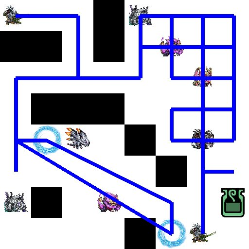
    


    Verbose: Displaying static maze maze_episode_final_1.jpg in Jupyter
    Verbose: Starting episode 2/100
    Verbose: Resetting environment
    Verbose: Episode 2 completed, total reward: 15, steps: 93
    Verbose: Generating static maze visualization as maze_episode_final_2.jpg
    Verbose: Static maze saved as maze_episode_final_2.jpg in /content
    


    
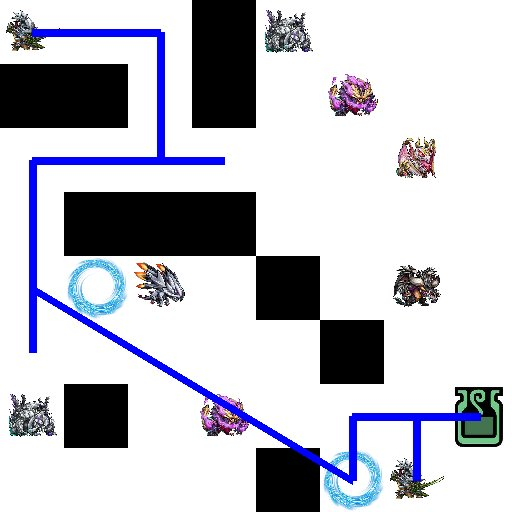
    


    Verbose: Displaying static maze maze_episode_final_2.jpg in Jupyter
    Verbose: Starting episode 3/100
    Verbose: Resetting environment
    Verbose: Episode 3 completed, total reward: 21, steps: 141
    Verbose: Generating static maze visualization as maze_episode_final_3.jpg
    Verbose: Static maze saved as maze_episode_final_3.jpg in /content
    


    
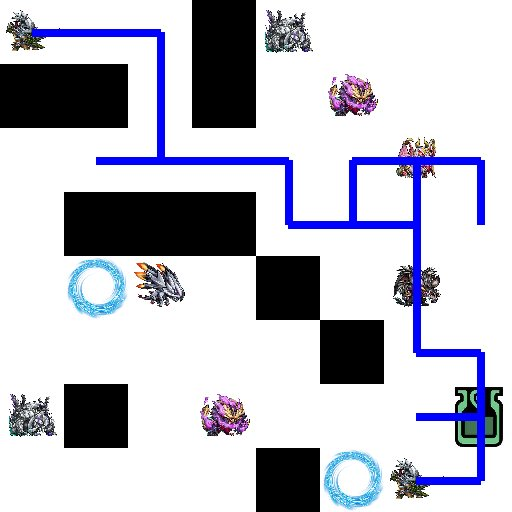
    


    Verbose: Displaying static maze maze_episode_final_3.jpg in Jupyter
    Verbose: Starting episode 4/100
    Verbose: Resetting environment
    Verbose: Episode 4 completed, total reward: 12, steps: 85
    Verbose: Generating static maze visualization as maze_episode_final_4.jpg
    Verbose: Static maze saved as maze_episode_final_4.jpg in /content
    


    
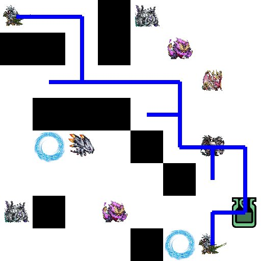
    


    Verbose: Displaying static maze maze_episode_final_4.jpg in Jupyter
    Verbose: Starting episode 5/100
    Verbose: Resetting environment
    Verbose: Episode 5 completed, total reward: 10, steps: 45
    Verbose: Generating static maze visualization as maze_episode_final_5.jpg
    Verbose: Static maze saved as maze_episode_final_5.jpg in /content
    


    

    


    Verbose: Displaying static maze maze_episode_final_5.jpg in Jupyter
    Verbose: Starting episode 6/100
    Verbose: Resetting environment
    Verbose: Episode 6 completed, total reward: 7, steps: 156
    Verbose: Generating static maze visualization as maze_episode_final_6.jpg
    Verbose: Static maze saved as maze_episode_final_6.jpg in /content
    


    
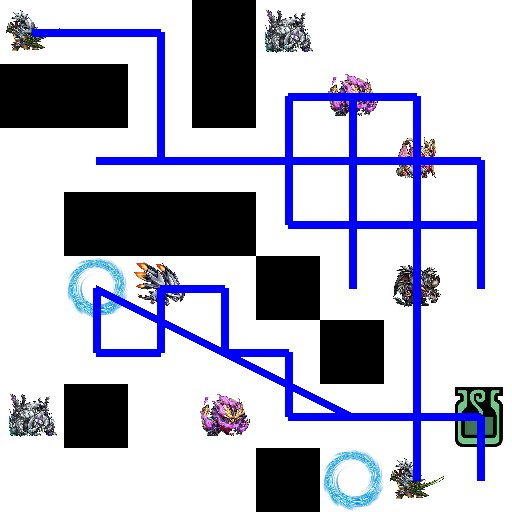
    


    Verbose: Displaying static maze maze_episode_final_6.jpg in Jupyter
    Verbose: Starting episode 7/100
    Verbose: Resetting environment
    Verbose: Episode 7 completed, total reward: 5, steps: 104
    Verbose: Generating static maze visualization as maze_episode_final_7.jpg
    Verbose: Static maze saved as maze_episode_final_7.jpg in /content
    


    
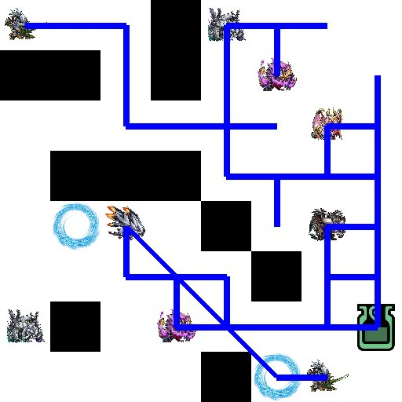
    


    Verbose: Displaying static maze maze_episode_final_7.jpg in Jupyter
    Verbose: Starting episode 8/100
    Verbose: Resetting environment
    Verbose: Episode 8 completed, total reward: -4, steps: 89
    Verbose: Generating static maze visualization as maze_episode_final_8.jpg
    Verbose: Static maze saved as maze_episode_final_8.jpg in /content
    


    

    


    Verbose: Displaying static maze maze_episode_final_8.jpg in Jupyter
    Verbose: Starting episode 9/100
    Verbose: Resetting environment
    Verbose: Episode 9 completed, total reward: 15, steps: 150
    Verbose: Generating static maze visualization as maze_episode_final_9.jpg
    Verbose: Static maze saved as maze_episode_final_9.jpg in /content
    


    
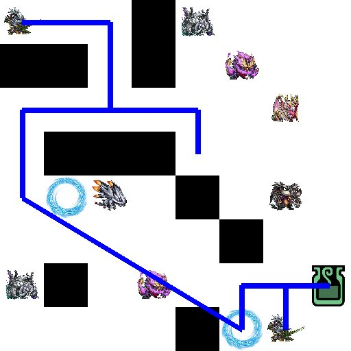
    


    Verbose: Displaying static maze maze_episode_final_9.jpg in Jupyter
    Verbose: Starting episode 10/100
    Verbose: Resetting environment
    Verbose: Episode 10 completed, total reward: 14, steps: 167
    Verbose: Generating static maze visualization as maze_episode_final_10.jpg
    Verbose: Static maze saved as maze_episode_final_10.jpg in /content
    


    
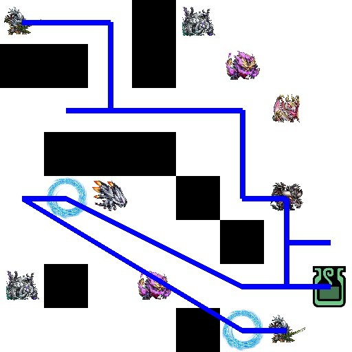
    


    Verbose: Displaying static maze maze_episode_final_10.jpg in Jupyter
    Verbose: Starting episode 11/100
    Verbose: Resetting environment
    Verbose: Episode 11 completed, total reward: -20, steps: 332
    Verbose: Generating static maze visualization as maze_episode_final_11.jpg
    Verbose: Static maze saved as maze_episode_final_11.jpg in /content
    


    
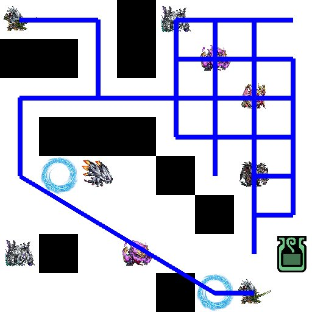
    


    Verbose: Displaying static maze maze_episode_final_11.jpg in Jupyter
    Verbose: Starting episode 12/100
    Verbose: Resetting environment
    Verbose: Episode 12 completed, total reward: 10, steps: 142
    Verbose: Generating static maze visualization as maze_episode_final_12.jpg
    Verbose: Static maze saved as maze_episode_final_12.jpg in /content
    


    

    


    Verbose: Displaying static maze maze_episode_final_12.jpg in Jupyter
    Verbose: Starting episode 13/100
    Verbose: Resetting environment
    Verbose: Episode 13 completed, total reward: 9, steps: 32
    Verbose: Generating static maze visualization as maze_episode_final_13.jpg
    Verbose: Static maze saved as maze_episode_final_13.jpg in /content
    


    
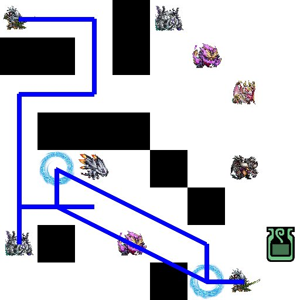
    


    Verbose: Displaying static maze maze_episode_final_13.jpg in Jupyter
    Verbose: Starting episode 14/100
    Verbose: Resetting environment
    Verbose: Episode 14 completed, total reward: 9, steps: 82
    Verbose: Generating static maze visualization as maze_episode_final_14.jpg
    Verbose: Static maze saved as maze_episode_final_14.jpg in /content
    


    
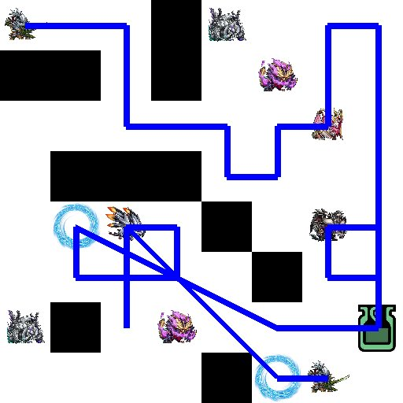
    


    Verbose: Displaying static maze maze_episode_final_14.jpg in Jupyter
    Verbose: Starting episode 15/100
    Verbose: Resetting environment
    Verbose: Episode 15 completed, total reward: -9, steps: 199
    Verbose: Generating static maze visualization as maze_episode_final_15.jpg
    Verbose: Static maze saved as maze_episode_final_15.jpg in /content
    


    
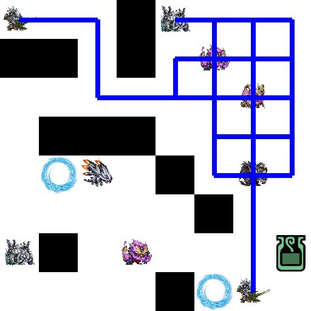
    


    Verbose: Displaying static maze maze_episode_final_15.jpg in Jupyter
    Verbose: Starting episode 16/100
    Verbose: Resetting environment
    Verbose: Episode 16 completed, total reward: -3, steps: 258
    Verbose: Generating static maze visualization as maze_episode_final_16.jpg
    Verbose: Static maze saved as maze_episode_final_16.jpg in /content
    


    
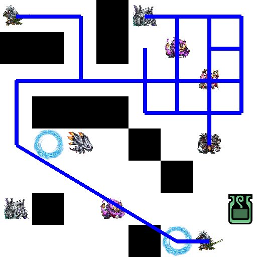
    


    Verbose: Displaying static maze maze_episode_final_16.jpg in Jupyter
    Verbose: Starting episode 17/100
    Verbose: Resetting environment
    Verbose: Episode 17 completed, total reward: 25, steps: 103
    Verbose: Generating static maze visualization as maze_episode_final_17.jpg
    Verbose: Static maze saved as maze_episode_final_17.jpg in /content
    


    
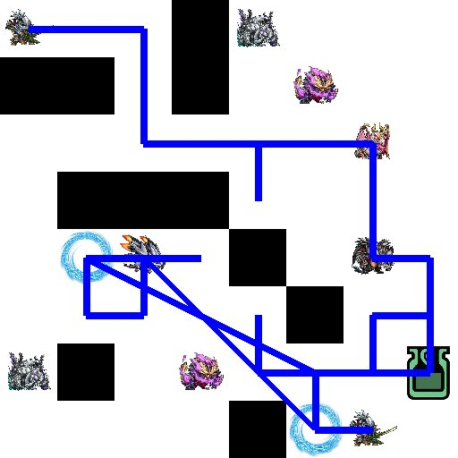
    


    Verbose: Displaying static maze maze_episode_final_17.jpg in Jupyter
    Verbose: Starting episode 18/100
    Verbose: Resetting environment
    Verbose: Episode 18 completed, total reward: 17, steps: 83
    Verbose: Generating static maze visualization as maze_episode_final_18.jpg
    Verbose: Static maze saved as maze_episode_final_18.jpg in /content
    


    
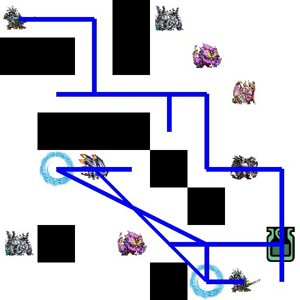
    


    Verbose: Displaying static maze maze_episode_final_18.jpg in Jupyter
    Verbose: Starting episode 19/100
    Verbose: Resetting environment
    Verbose: Episode 19 completed, total reward: 41, steps: 149
    Verbose: Generating static maze visualization as maze_episode_final_19.jpg
    Verbose: Static maze saved as maze_episode_final_19.jpg in /content
    


    
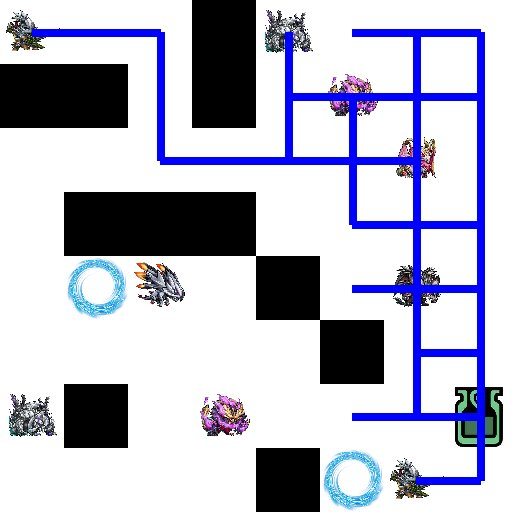
    


    Verbose: Displaying static maze maze_episode_final_19.jpg in Jupyter
    Verbose: Starting episode 20/100
    Verbose: Resetting environment
    Verbose: Episode 20 completed, total reward: -3, steps: 136
    Verbose: Generating static maze visualization as maze_episode_final_20.jpg
    Verbose: Static maze saved as maze_episode_final_20.jpg in /content
    


    
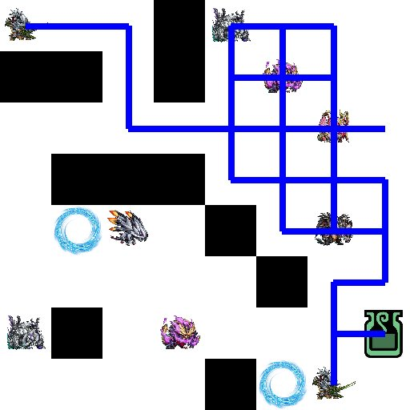
    


    Verbose: Displaying static maze maze_episode_final_20.jpg in Jupyter
    Verbose: Starting episode 21/100
    Verbose: Resetting environment
    Verbose: Episode 21 completed, total reward: -47, steps: 359
    Verbose: Generating static maze visualization as maze_episode_final_21.jpg
    Verbose: Static maze saved as maze_episode_final_21.jpg in /content
    


    
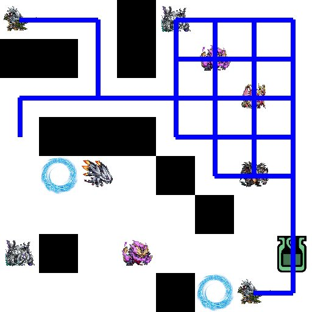
    


    Verbose: Displaying static maze maze_episode_final_21.jpg in Jupyter
    Verbose: Starting episode 22/100
    Verbose: Resetting environment
    Verbose: Episode 22 completed, total reward: 67, steps: 158
    Verbose: Generating static maze visualization as maze_episode_final_22.jpg
    Verbose: Static maze saved as maze_episode_final_22.jpg in /content
    


    
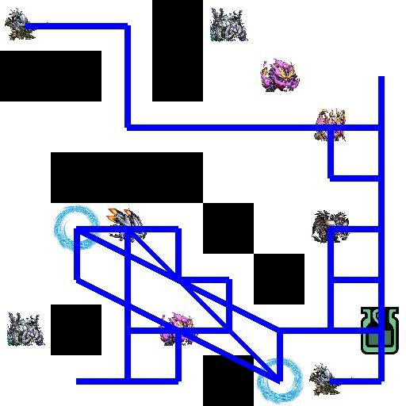
    


    Verbose: Displaying static maze maze_episode_final_22.jpg in Jupyter
    Verbose: Starting episode 23/100
    Verbose: Resetting environment
    Verbose: Episode 23 completed, total reward: -8, steps: 138
    Verbose: Generating static maze visualization as maze_episode_final_23.jpg
    Verbose: Static maze saved as maze_episode_final_23.jpg in /content
    


    
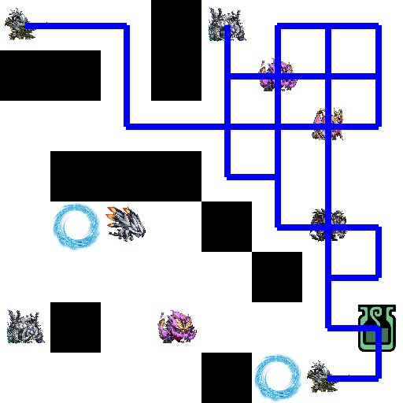
    


    Verbose: Displaying static maze maze_episode_final_23.jpg in Jupyter
    Verbose: Starting episode 24/100
    Verbose: Resetting environment
    Verbose: Episode 24 completed, total reward: 12, steps: 120
    Verbose: Generating static maze visualization as maze_episode_final_24.jpg
    Verbose: Static maze saved as maze_episode_final_24.jpg in /content
    


    
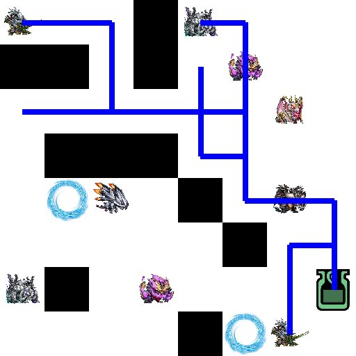
    


    Verbose: Displaying static maze maze_episode_final_24.jpg in Jupyter
    Verbose: Starting episode 25/100
    Verbose: Resetting environment
    Verbose: Episode 25 completed, total reward: 8, steps: 68
    Verbose: Generating static maze visualization as maze_episode_final_25.jpg
    Verbose: Static maze saved as maze_episode_final_25.jpg in /content
    


    

    


    Verbose: Displaying static maze maze_episode_final_25.jpg in Jupyter
    Verbose: Starting episode 26/100
    Verbose: Resetting environment
    Verbose: Episode 26 completed, total reward: 9, steps: 209
    Verbose: Generating static maze visualization as maze_episode_final_26.jpg
    Verbose: Static maze saved as maze_episode_final_26.jpg in /content
    


    
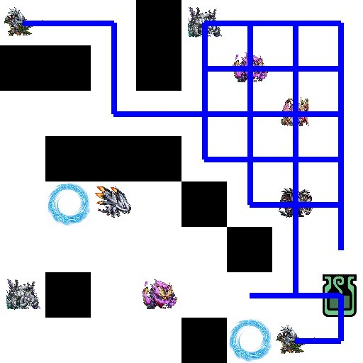
    


    Verbose: Displaying static maze maze_episode_final_26.jpg in Jupyter
    Verbose: Starting episode 27/100
    Verbose: Resetting environment
    Verbose: Episode 27 completed, total reward: 26, steps: 294
    Verbose: Generating static maze visualization as maze_episode_final_27.jpg
    Verbose: Static maze saved as maze_episode_final_27.jpg in /content
    


    
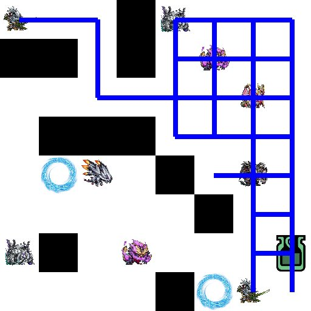
    


    Verbose: Displaying static maze maze_episode_final_27.jpg in Jupyter
    Verbose: Starting episode 28/100
    Verbose: Resetting environment
    Verbose: Episode 28 completed, total reward: 1, steps: 83
    Verbose: Generating static maze visualization as maze_episode_final_28.jpg
    Verbose: Static maze saved as maze_episode_final_28.jpg in /content
    


    
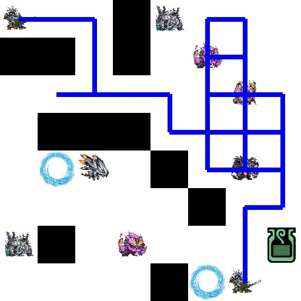
    


    Verbose: Displaying static maze maze_episode_final_28.jpg in Jupyter
    Verbose: Starting episode 29/100
    Verbose: Resetting environment
    Verbose: Episode 29 completed, total reward: 10, steps: 73
    Verbose: Generating static maze visualization as maze_episode_final_29.jpg
    Verbose: Static maze saved as maze_episode_final_29.jpg in /content
    


    
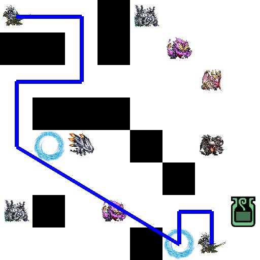
    


    Verbose: Displaying static maze maze_episode_final_29.jpg in Jupyter
    Verbose: Starting episode 30/100
    Verbose: Resetting environment
    Verbose: Episode 30 completed, total reward: 7, steps: 70
    Verbose: Generating static maze visualization as maze_episode_final_30.jpg
    Verbose: Static maze saved as maze_episode_final_30.jpg in /content
    


    
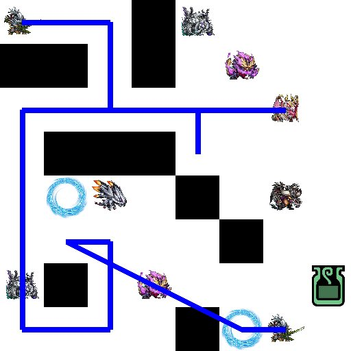
    


    Verbose: Displaying static maze maze_episode_final_30.jpg in Jupyter
    Verbose: Starting episode 31/100
    Verbose: Resetting environment
    Verbose: Episode 31 completed, total reward: 10, steps: 46
    Verbose: Generating static maze visualization as maze_episode_final_31.jpg
    Verbose: Static maze saved as maze_episode_final_31.jpg in /content
    


    
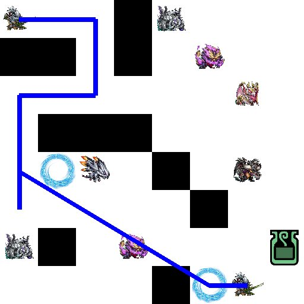
    


    Verbose: Displaying static maze maze_episode_final_31.jpg in Jupyter
    Verbose: Starting episode 32/100
    Verbose: Resetting environment
    Verbose: Episode 32 completed, total reward: 85, steps: 134
    Verbose: Generating static maze visualization as maze_episode_final_32.jpg
    Verbose: Static maze saved as maze_episode_final_32.jpg in /content
    


    
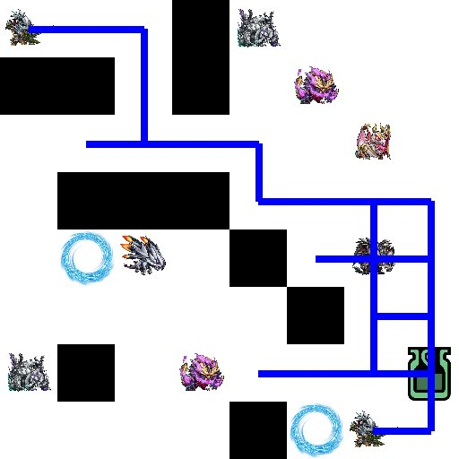
    


    Verbose: Displaying static maze maze_episode_final_32.jpg in Jupyter
    Verbose: Starting episode 33/100
    Verbose: Resetting environment
    Verbose: Episode 33 completed, total reward: 12, steps: 63
    Verbose: Generating static maze visualization as maze_episode_final_33.jpg
    Verbose: Static maze saved as maze_episode_final_33.jpg in /content
    


    
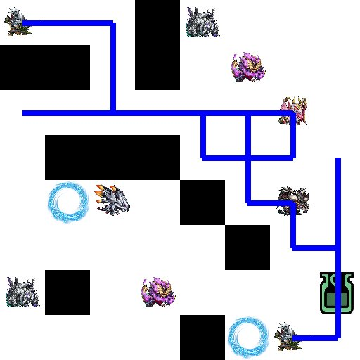
    


    Verbose: Displaying static maze maze_episode_final_33.jpg in Jupyter
    Verbose: Starting episode 34/100
    Verbose: Resetting environment
    Verbose: Episode 34 completed, total reward: 7, steps: 57
    Verbose: Generating static maze visualization as maze_episode_final_34.jpg
    Verbose: Static maze saved as maze_episode_final_34.jpg in /content
    


    
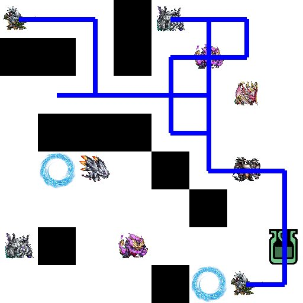
    


    Verbose: Displaying static maze maze_episode_final_34.jpg in Jupyter
    Verbose: Starting episode 35/100
    Verbose: Resetting environment
    Verbose: Episode 35 completed, total reward: 121, steps: 258
    Verbose: Generating static maze visualization as maze_episode_final_35.jpg
    Verbose: Static maze saved as maze_episode_final_35.jpg in /content
    


    

    


    Verbose: Displaying static maze maze_episode_final_35.jpg in Jupyter
    Verbose: Starting episode 36/100
    Verbose: Resetting environment
    Verbose: Episode 36 completed, total reward: 11, steps: 141
    Verbose: Generating static maze visualization as maze_episode_final_36.jpg
    Verbose: Static maze saved as maze_episode_final_36.jpg in /content
    


    
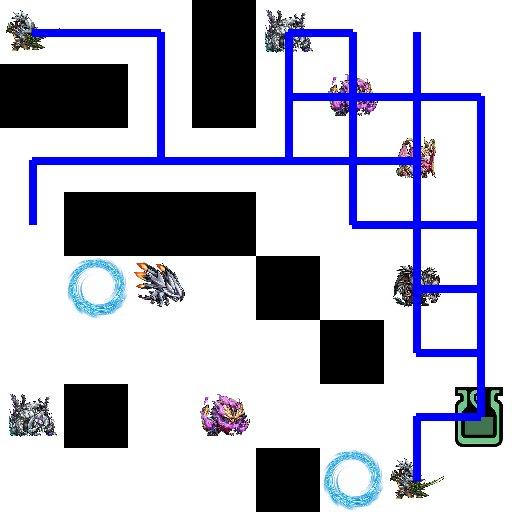
    


    Verbose: Displaying static maze maze_episode_final_36.jpg in Jupyter
    Verbose: Starting episode 37/100
    Verbose: Resetting environment
    Verbose: Episode 37 completed, total reward: 52, steps: 83
    Verbose: Generating static maze visualization as maze_episode_final_37.jpg
    Verbose: Static maze saved as maze_episode_final_37.jpg in /content
    


    
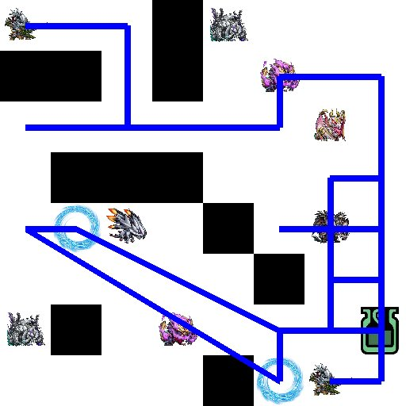
    


    Verbose: Displaying static maze maze_episode_final_37.jpg in Jupyter
    Verbose: Starting episode 38/100
    Verbose: Resetting environment
    Verbose: Episode 38 completed, total reward: 39, steps: 74
    Verbose: Generating static maze visualization as maze_episode_final_38.jpg
    Verbose: Static maze saved as maze_episode_final_38.jpg in /content
    


    
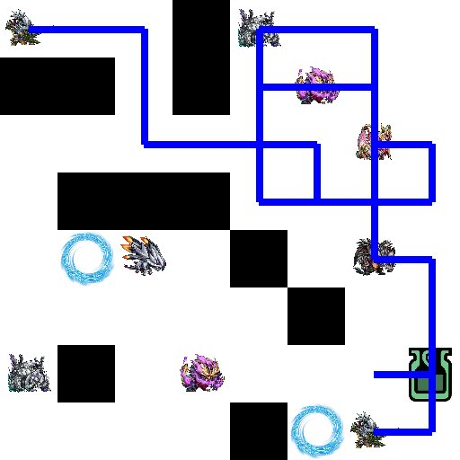
    


    Verbose: Displaying static maze maze_episode_final_38.jpg in Jupyter
    Verbose: Starting episode 39/100
    Verbose: Resetting environment
    Verbose: Episode 39 completed, total reward: 6, steps: 48
    Verbose: Generating static maze visualization as maze_episode_final_39.jpg
    Verbose: Static maze saved as maze_episode_final_39.jpg in /content
    


    
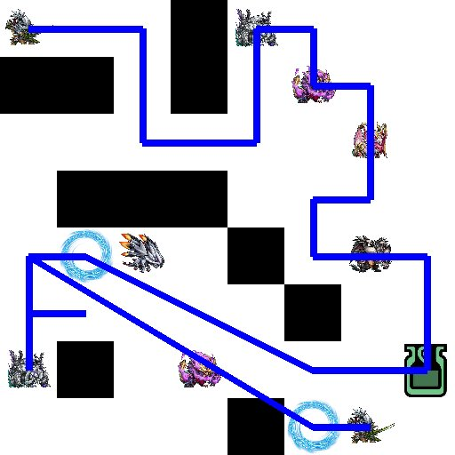
    


    Verbose: Displaying static maze maze_episode_final_39.jpg in Jupyter
    Verbose: Starting episode 40/100
    Verbose: Resetting environment
    Verbose: Episode 40 completed, total reward: 25, steps: 47
    Verbose: Generating static maze visualization as maze_episode_final_40.jpg
    Verbose: Static maze saved as maze_episode_final_40.jpg in /content
    


    
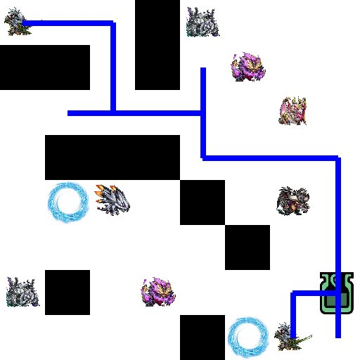
    


    Verbose: Displaying static maze maze_episode_final_40.jpg in Jupyter
    Verbose: Starting episode 41/100
    Verbose: Resetting environment
    Verbose: Episode 41 completed, total reward: 66, steps: 181
    Verbose: Generating static maze visualization as maze_episode_final_41.jpg
    Verbose: Static maze saved as maze_episode_final_41.jpg in /content
    


    
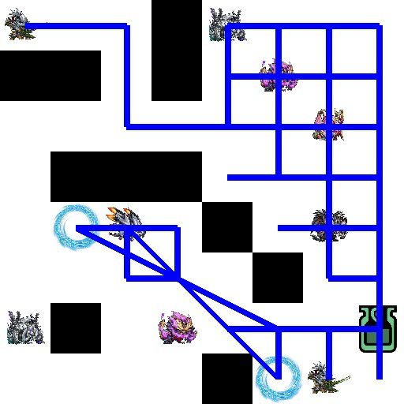
    


    Verbose: Displaying static maze maze_episode_final_41.jpg in Jupyter
    Verbose: Starting episode 42/100
    Verbose: Resetting environment
    Verbose: Episode 42 completed, total reward: 7, steps: 46
    Verbose: Generating static maze visualization as maze_episode_final_42.jpg
    Verbose: Static maze saved as maze_episode_final_42.jpg in /content
    


    
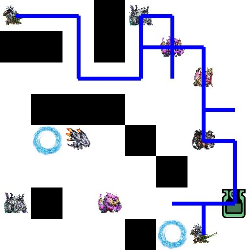
    


    Verbose: Displaying static maze maze_episode_final_42.jpg in Jupyter
    Verbose: Starting episode 43/100
    Verbose: Resetting environment
    Verbose: Episode 43 completed, total reward: 17, steps: 43
    Verbose: Generating static maze visualization as maze_episode_final_43.jpg
    Verbose: Static maze saved as maze_episode_final_43.jpg in /content
    


    
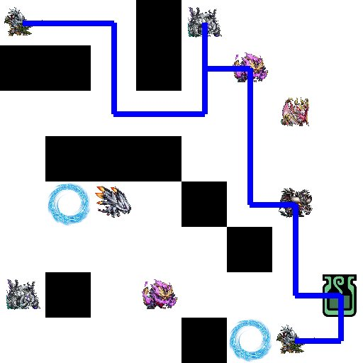
    


    Verbose: Displaying static maze maze_episode_final_43.jpg in Jupyter
    Verbose: Starting episode 44/100
    Verbose: Resetting environment
    Verbose: Episode 44 completed, total reward: 12, steps: 53
    Verbose: Generating static maze visualization as maze_episode_final_44.jpg
    Verbose: Static maze saved as maze_episode_final_44.jpg in /content
    


    
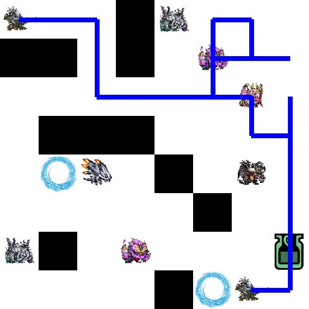
    


    Verbose: Displaying static maze maze_episode_final_44.jpg in Jupyter
    Verbose: Starting episode 45/100
    Verbose: Resetting environment
    Verbose: Episode 45 completed, total reward: 42, steps: 63
    Verbose: Generating static maze visualization as maze_episode_final_45.jpg
    Verbose: Static maze saved as maze_episode_final_45.jpg in /content
    


    
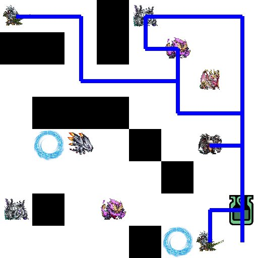
    


    Verbose: Displaying static maze maze_episode_final_45.jpg in Jupyter
    Verbose: Starting episode 46/100
    Verbose: Resetting environment
    Verbose: Episode 46 completed, total reward: 36, steps: 105
    Verbose: Generating static maze visualization as maze_episode_final_46.jpg
    Verbose: Static maze saved as maze_episode_final_46.jpg in /content
    


    
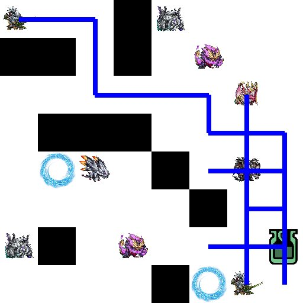
    


    Verbose: Displaying static maze maze_episode_final_46.jpg in Jupyter
    Verbose: Starting episode 47/100
    Verbose: Resetting environment
    Verbose: Episode 47 completed, total reward: 37, steps: 111
    Verbose: Generating static maze visualization as maze_episode_final_47.jpg
    Verbose: Static maze saved as maze_episode_final_47.jpg in /content
    


    
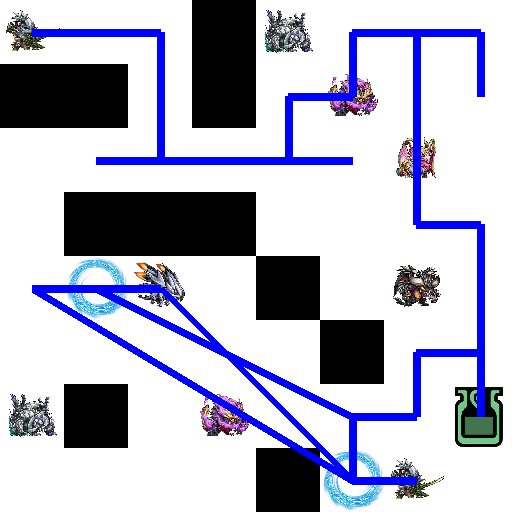
    


    Verbose: Displaying static maze maze_episode_final_47.jpg in Jupyter
    Verbose: Starting episode 48/100
    Verbose: Resetting environment
    Verbose: Episode 48 completed, total reward: 14, steps: 66
    Verbose: Generating static maze visualization as maze_episode_final_48.jpg
    Verbose: Static maze saved as maze_episode_final_48.jpg in /content
    


    

    


    Verbose: Displaying static maze maze_episode_final_48.jpg in Jupyter
    Verbose: Starting episode 49/100
    Verbose: Resetting environment
    Verbose: Episode 49 completed, total reward: 24, steps: 152
    Verbose: Generating static maze visualization as maze_episode_final_49.jpg
    Verbose: Static maze saved as maze_episode_final_49.jpg in /content
    


    
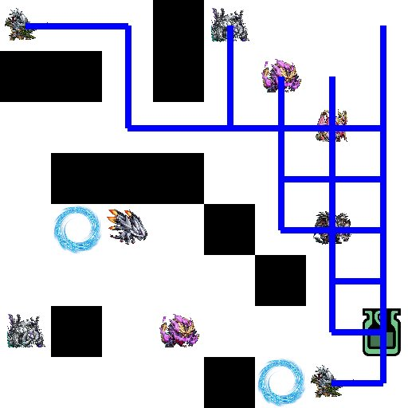
    


    Verbose: Displaying static maze maze_episode_final_49.jpg in Jupyter
    Verbose: Starting episode 50/100
    Verbose: Resetting environment
    Verbose: Episode 50 completed, total reward: 221, steps: 280
    Verbose: Generating static maze visualization as maze_episode_final_50.jpg
    Verbose: Static maze saved as maze_episode_final_50.jpg in /content
    


    
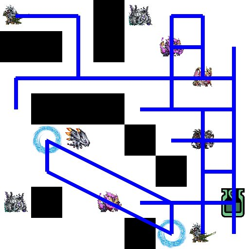
    


    Verbose: Displaying static maze maze_episode_final_50.jpg in Jupyter
    Verbose: Starting episode 51/100
    Verbose: Resetting environment
    Verbose: Episode 51 completed, total reward: 172, steps: 170
    Verbose: Generating static maze visualization as maze_episode_final_51.jpg
    Verbose: Static maze saved as maze_episode_final_51.jpg in /content
    


    
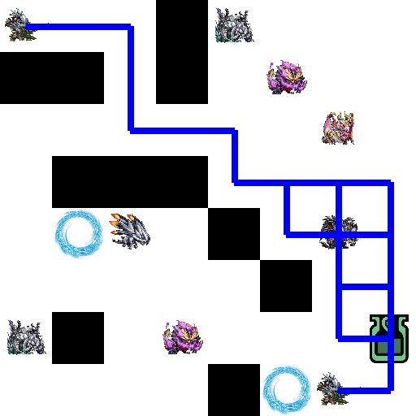
    


    Verbose: Displaying static maze maze_episode_final_51.jpg in Jupyter
    Verbose: Starting episode 52/100
    Verbose: Resetting environment
    Verbose: Episode 52 completed, total reward: 27, steps: 87
    Verbose: Generating static maze visualization as maze_episode_final_52.jpg
    Verbose: Static maze saved as maze_episode_final_52.jpg in /content
    


    
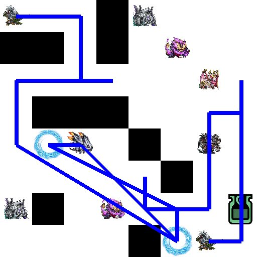
    


    Verbose: Displaying static maze maze_episode_final_52.jpg in Jupyter
    Verbose: Starting episode 53/100
    Verbose: Resetting environment
    Verbose: Episode 53 completed, total reward: 18, steps: 86
    Verbose: Generating static maze visualization as maze_episode_final_53.jpg
    Verbose: Static maze saved as maze_episode_final_53.jpg in /content
    


    
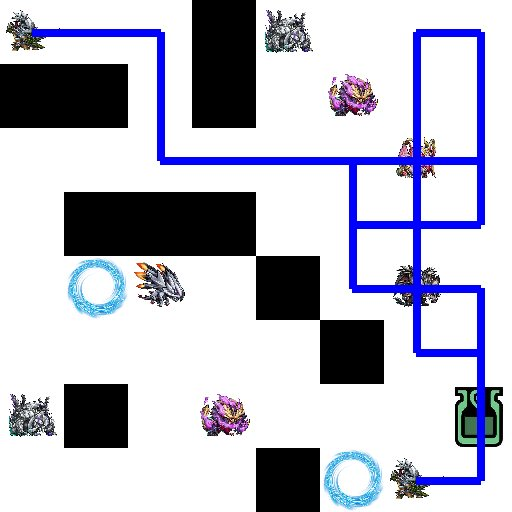
    


    Verbose: Displaying static maze maze_episode_final_53.jpg in Jupyter
    Verbose: Starting episode 54/100
    Verbose: Resetting environment
    Verbose: Episode 54 completed, total reward: 96, steps: 102
    Verbose: Generating static maze visualization as maze_episode_final_54.jpg
    Verbose: Static maze saved as maze_episode_final_54.jpg in /content
    


    
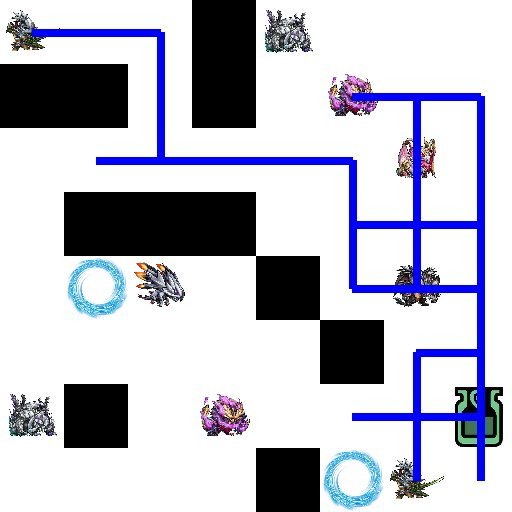
    


    Verbose: Displaying static maze maze_episode_final_54.jpg in Jupyter
    Verbose: Starting episode 55/100
    Verbose: Resetting environment
    Verbose: Episode 55 completed, total reward: 8, steps: 94
    Verbose: Generating static maze visualization as maze_episode_final_55.jpg
    Verbose: Static maze saved as maze_episode_final_55.jpg in /content
    


    
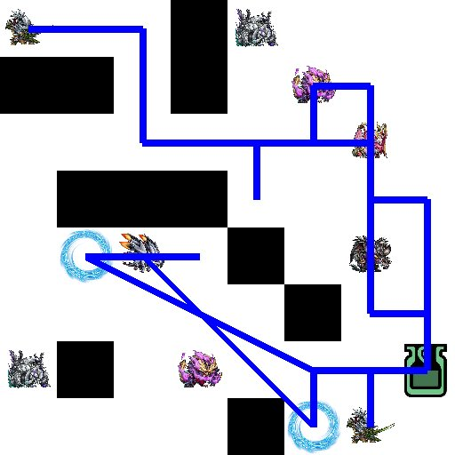
    


    Verbose: Displaying static maze maze_episode_final_55.jpg in Jupyter
    Verbose: Starting episode 56/100
    Verbose: Resetting environment
    Verbose: Episode 56 completed, total reward: 95, steps: 99
    Verbose: Generating static maze visualization as maze_episode_final_56.jpg
    Verbose: Static maze saved as maze_episode_final_56.jpg in /content
    


    
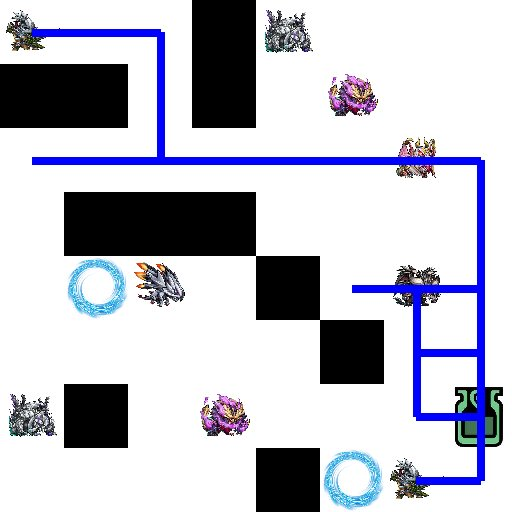
    


    Verbose: Displaying static maze maze_episode_final_56.jpg in Jupyter
    Verbose: Starting episode 57/100
    Verbose: Resetting environment
    Verbose: Episode 57 completed, total reward: 14, steps: 32
    Verbose: Generating static maze visualization as maze_episode_final_57.jpg
    Verbose: Static maze saved as maze_episode_final_57.jpg in /content
    


    
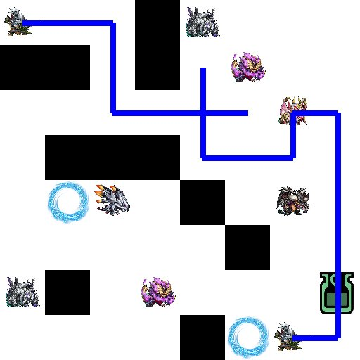
    


    Verbose: Displaying static maze maze_episode_final_57.jpg in Jupyter
    Verbose: Starting episode 58/100
    Verbose: Resetting environment
    Verbose: Episode 58 completed, total reward: 109, steps: 96
    Verbose: Generating static maze visualization as maze_episode_final_58.jpg
    Verbose: Static maze saved as maze_episode_final_58.jpg in /content
    


    
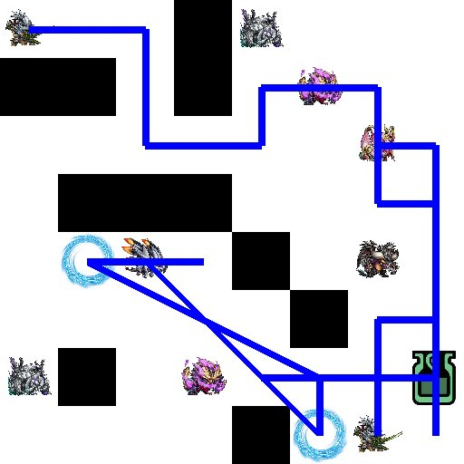
    


    Verbose: Displaying static maze maze_episode_final_58.jpg in Jupyter
    Verbose: Starting episode 59/100
    Verbose: Resetting environment
    Verbose: Episode 59 completed, total reward: 22, steps: 108
    Verbose: Generating static maze visualization as maze_episode_final_59.jpg
    Verbose: Static maze saved as maze_episode_final_59.jpg in /content
    


    
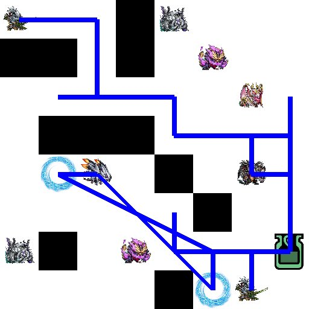
    


    Verbose: Displaying static maze maze_episode_final_59.jpg in Jupyter
    Verbose: Starting episode 60/100
    Verbose: Resetting environment
    Verbose: Episode 60 completed, total reward: 78, steps: 72
    Verbose: Generating static maze visualization as maze_episode_final_60.jpg
    Verbose: Static maze saved as maze_episode_final_60.jpg in /content
    


    
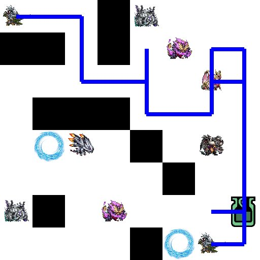
    


    Verbose: Displaying static maze maze_episode_final_60.jpg in Jupyter
    Verbose: Starting episode 61/100
    Verbose: Resetting environment
    Verbose: Episode 61 completed, total reward: 139, steps: 201
    Verbose: Generating static maze visualization as maze_episode_final_61.jpg
    Verbose: Static maze saved as maze_episode_final_61.jpg in /content
    


    
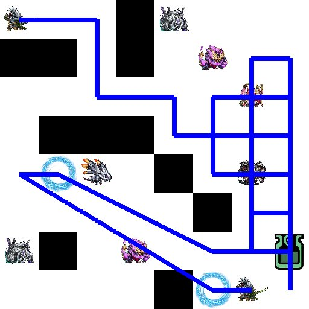
    


    Verbose: Displaying static maze maze_episode_final_61.jpg in Jupyter
    Verbose: Starting episode 62/100
    Verbose: Resetting environment
    Verbose: Episode 62 completed, total reward: 15, steps: 92
    Verbose: Generating static maze visualization as maze_episode_final_62.jpg
    Verbose: Static maze saved as maze_episode_final_62.jpg in /content
    


    
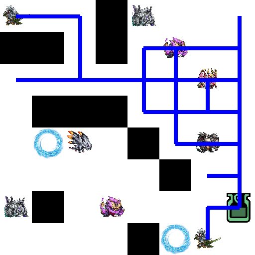
    


    Verbose: Displaying static maze maze_episode_final_62.jpg in Jupyter
    Verbose: Starting episode 63/100
    Verbose: Resetting environment
    Verbose: Episode 63 completed, total reward: 26, steps: 58
    Verbose: Generating static maze visualization as maze_episode_final_63.jpg
    Verbose: Static maze saved as maze_episode_final_63.jpg in /content
    


    
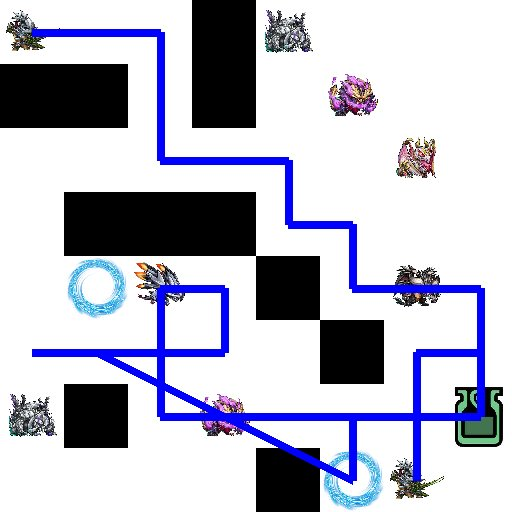
    


    Verbose: Displaying static maze maze_episode_final_63.jpg in Jupyter
    Verbose: Starting episode 64/100
    Verbose: Resetting environment
    Verbose: Episode 64 completed, total reward: 42, steps: 71
    Verbose: Generating static maze visualization as maze_episode_final_64.jpg
    Verbose: Static maze saved as maze_episode_final_64.jpg in /content
    


    
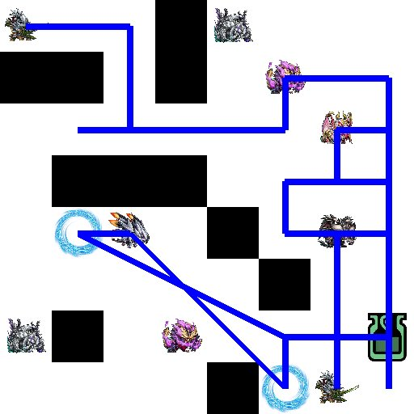
    


    Verbose: Displaying static maze maze_episode_final_64.jpg in Jupyter
    Verbose: Starting episode 65/100
    Verbose: Resetting environment
    Verbose: Episode 65 completed, total reward: 32, steps: 66
    Verbose: Generating static maze visualization as maze_episode_final_65.jpg
    Verbose: Static maze saved as maze_episode_final_65.jpg in /content
    


    
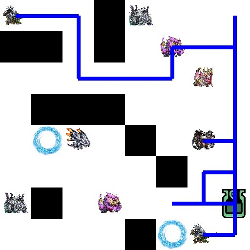
    


    Verbose: Displaying static maze maze_episode_final_65.jpg in Jupyter
    Verbose: Starting episode 66/100
    Verbose: Resetting environment
    Verbose: Episode 66 completed, total reward: 10, steps: 89
    Verbose: Generating static maze visualization as maze_episode_final_66.jpg
    Verbose: Static maze saved as maze_episode_final_66.jpg in /content
    


    
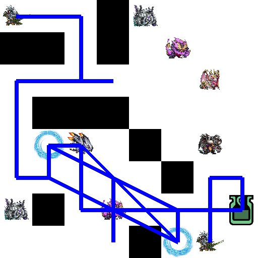
    


    Verbose: Displaying static maze maze_episode_final_66.jpg in Jupyter
    Verbose: Starting episode 67/100
    Verbose: Resetting environment
    Verbose: Episode 67 completed, total reward: 79, steps: 191
    Verbose: Generating static maze visualization as maze_episode_final_67.jpg
    Verbose: Static maze saved as maze_episode_final_67.jpg in /content
    


    
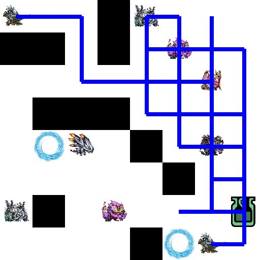
    


    Verbose: Displaying static maze maze_episode_final_67.jpg in Jupyter
    Verbose: Starting episode 68/100
    Verbose: Resetting environment
    Verbose: Episode 68 completed, total reward: 6, steps: 43
    Verbose: Generating static maze visualization as maze_episode_final_68.jpg
    Verbose: Static maze saved as maze_episode_final_68.jpg in /content
    


    
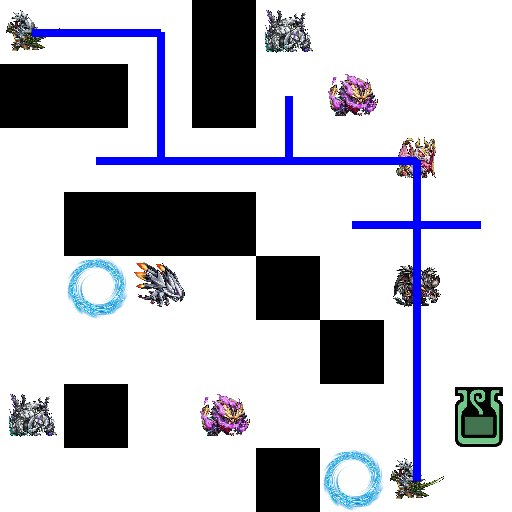
    


    Verbose: Displaying static maze maze_episode_final_68.jpg in Jupyter
    Verbose: Starting episode 69/100
    Verbose: Resetting environment
    Verbose: Episode 69 completed, total reward: 95, steps: 77
    Verbose: Generating static maze visualization as maze_episode_final_69.jpg
    Verbose: Static maze saved as maze_episode_final_69.jpg in /content
    


    
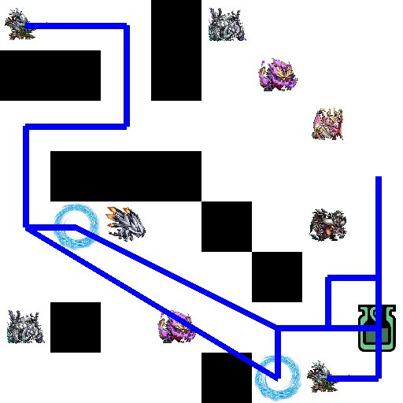
    


    Verbose: Displaying static maze maze_episode_final_69.jpg in Jupyter
    Verbose: Starting episode 70/100
    Verbose: Resetting environment
    Verbose: Episode 70 completed, total reward: 17, steps: 101
    Verbose: Generating static maze visualization as maze_episode_final_70.jpg
    Verbose: Static maze saved as maze_episode_final_70.jpg in /content
    


    
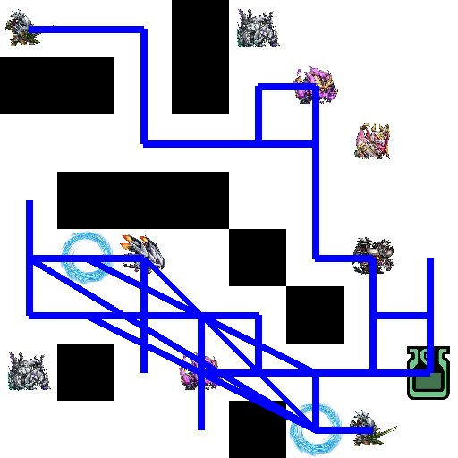
    


    Verbose: Displaying static maze maze_episode_final_70.jpg in Jupyter
    Verbose: Starting episode 71/100
    Verbose: Resetting environment
    Verbose: Episode 71 completed, total reward: 8, steps: 65
    Verbose: Generating static maze visualization as maze_episode_final_71.jpg
    Verbose: Static maze saved as maze_episode_final_71.jpg in /content
    


    
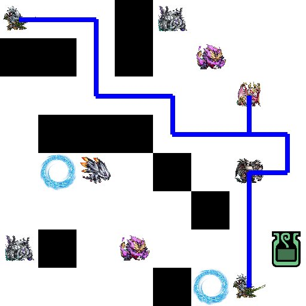
    


    Verbose: Displaying static maze maze_episode_final_71.jpg in Jupyter
    Verbose: Starting episode 72/100
    Verbose: Resetting environment
    Verbose: Episode 72 completed, total reward: 45, steps: 58
    Verbose: Generating static maze visualization as maze_episode_final_72.jpg
    Verbose: Static maze saved as maze_episode_final_72.jpg in /content
    


    
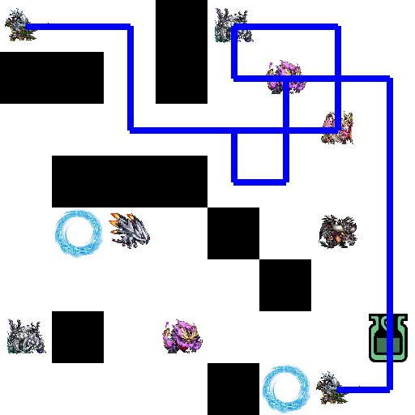
    


    Verbose: Displaying static maze maze_episode_final_72.jpg in Jupyter
    Verbose: Starting episode 73/100
    Verbose: Resetting environment
    Verbose: Episode 73 completed, total reward: 182, steps: 145
    Verbose: Generating static maze visualization as maze_episode_final_73.jpg
    Verbose: Static maze saved as maze_episode_final_73.jpg in /content
    


    
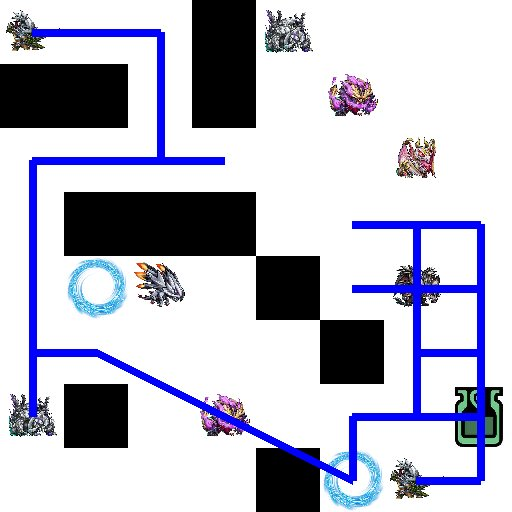
    


    Verbose: Displaying static maze maze_episode_final_73.jpg in Jupyter
    Verbose: Starting episode 74/100
    Verbose: Resetting environment
    Verbose: Episode 74 completed, total reward: 35, steps: 61
    Verbose: Generating static maze visualization as maze_episode_final_74.jpg
    Verbose: Static maze saved as maze_episode_final_74.jpg in /content
    


    
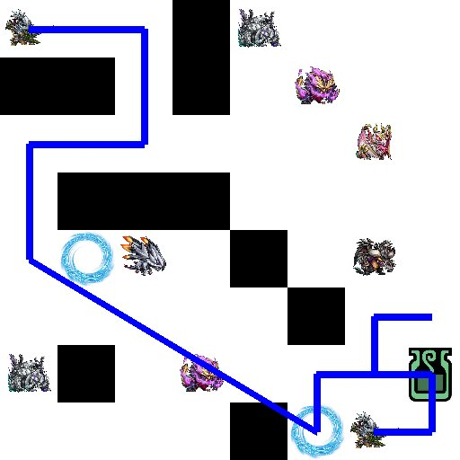
    


    Verbose: Displaying static maze maze_episode_final_74.jpg in Jupyter
    Verbose: Starting episode 75/100
    Verbose: Resetting environment
    Verbose: Episode 75 completed, total reward: 33, steps: 32
    Verbose: Generating static maze visualization as maze_episode_final_75.jpg
    Verbose: Static maze saved as maze_episode_final_75.jpg in /content
    


    

    


    Verbose: Displaying static maze maze_episode_final_75.jpg in Jupyter
    Verbose: Starting episode 76/100
    Verbose: Resetting environment
    Verbose: Episode 76 completed, total reward: 8, steps: 34
    Verbose: Generating static maze visualization as maze_episode_final_76.jpg
    Verbose: Static maze saved as maze_episode_final_76.jpg in /content
    


    

    


    Verbose: Displaying static maze maze_episode_final_76.jpg in Jupyter
    Verbose: Starting episode 77/100
    Verbose: Resetting environment
    Verbose: Episode 77 completed, total reward: 8, steps: 30
    Verbose: Generating static maze visualization as maze_episode_final_77.jpg
    Verbose: Static maze saved as maze_episode_final_77.jpg in /content
    


    
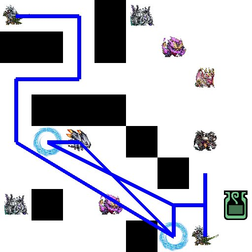
    


    Verbose: Displaying static maze maze_episode_final_77.jpg in Jupyter
    Verbose: Starting episode 78/100
    Verbose: Resetting environment
    Verbose: Episode 78 completed, total reward: 93, steps: 68
    Verbose: Generating static maze visualization as maze_episode_final_78.jpg
    Verbose: Static maze saved as maze_episode_final_78.jpg in /content
    


    
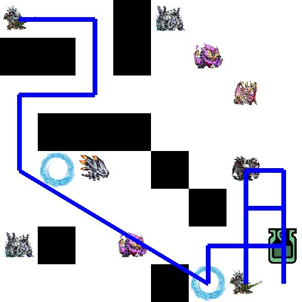
    


    Verbose: Displaying static maze maze_episode_final_78.jpg in Jupyter
    Verbose: Starting episode 79/100
    Verbose: Resetting environment
    Verbose: Episode 79 completed, total reward: 10, steps: 31
    Verbose: Generating static maze visualization as maze_episode_final_79.jpg
    Verbose: Static maze saved as maze_episode_final_79.jpg in /content
    


    
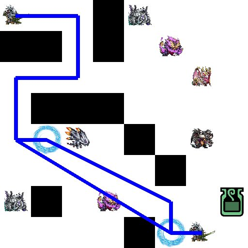
    


    Verbose: Displaying static maze maze_episode_final_79.jpg in Jupyter
    Verbose: Starting episode 80/100
    Verbose: Resetting environment
    Verbose: Episode 80 completed, total reward: 60, steps: 36
    Verbose: Generating static maze visualization as maze_episode_final_80.jpg
    Verbose: Static maze saved as maze_episode_final_80.jpg in /content
    


    
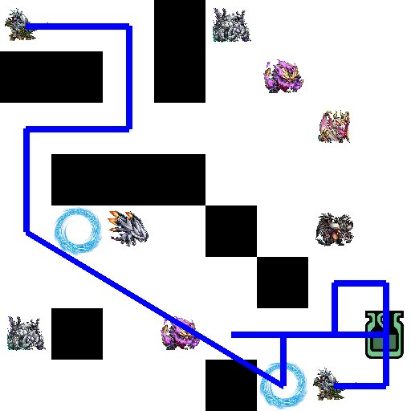
    


    Verbose: Displaying static maze maze_episode_final_80.jpg in Jupyter
    Verbose: Starting episode 81/100
    Verbose: Resetting environment
    Verbose: Episode 81 completed, total reward: 83, steps: 166
    Verbose: Generating static maze visualization as maze_episode_final_81.jpg
    Verbose: Static maze saved as maze_episode_final_81.jpg in /content
    


    
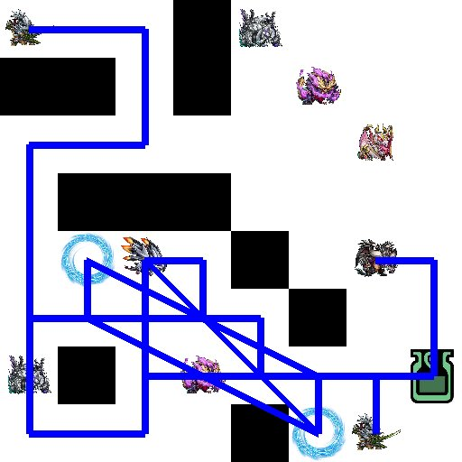
    


    Verbose: Displaying static maze maze_episode_final_81.jpg in Jupyter
    Verbose: Starting episode 82/100
    Verbose: Resetting environment
    Verbose: Episode 82 completed, total reward: 45, steps: 86
    Verbose: Generating static maze visualization as maze_episode_final_82.jpg
    Verbose: Static maze saved as maze_episode_final_82.jpg in /content
    


    
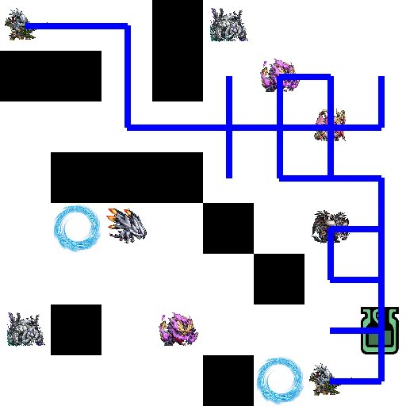
    


    Verbose: Displaying static maze maze_episode_final_82.jpg in Jupyter
    Verbose: Starting episode 83/100
    Verbose: Resetting environment
    Verbose: Episode 83 completed, total reward: 10, steps: 16
    Verbose: Generating static maze visualization as maze_episode_final_83.jpg
    Verbose: Static maze saved as maze_episode_final_83.jpg in /content
    


    

    


    Verbose: Displaying static maze maze_episode_final_83.jpg in Jupyter
    Verbose: Starting episode 84/100
    Verbose: Resetting environment
    Verbose: Episode 84 completed, total reward: 10, steps: 26
    Verbose: Generating static maze visualization as maze_episode_final_84.jpg
    Verbose: Static maze saved as maze_episode_final_84.jpg in /content
    


    
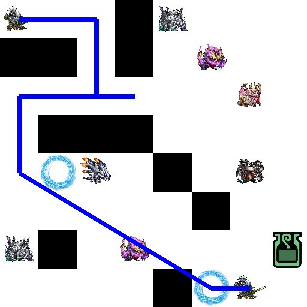
    


    Verbose: Displaying static maze maze_episode_final_84.jpg in Jupyter
    Verbose: Starting episode 85/100
    Verbose: Resetting environment
    Verbose: Episode 85 completed, total reward: 79, steps: 110
    Verbose: Generating static maze visualization as maze_episode_final_85.jpg
    Verbose: Static maze saved as maze_episode_final_85.jpg in /content
    


    
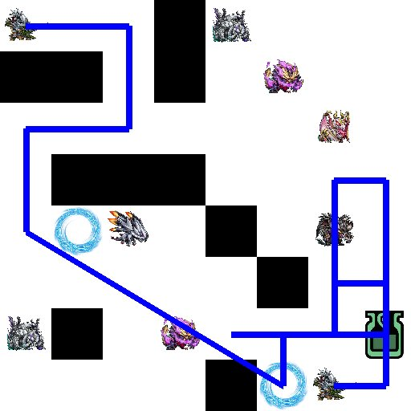
    


    Verbose: Displaying static maze maze_episode_final_85.jpg in Jupyter
    Verbose: Starting episode 86/100
    Verbose: Resetting environment
    Verbose: Episode 86 completed, total reward: 25, steps: 39
    Verbose: Generating static maze visualization as maze_episode_final_86.jpg
    Verbose: Static maze saved as maze_episode_final_86.jpg in /content
    


    
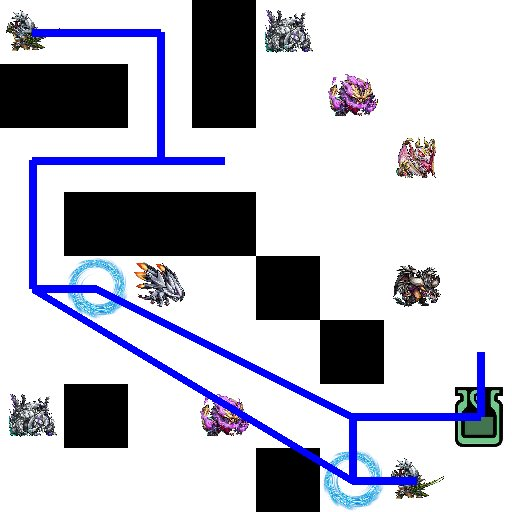
    


    Verbose: Displaying static maze maze_episode_final_86.jpg in Jupyter
    Verbose: Starting episode 87/100
    Verbose: Resetting environment
    Verbose: Episode 87 completed, total reward: 10, steps: 28
    Verbose: Generating static maze visualization as maze_episode_final_87.jpg
    Verbose: Static maze saved as maze_episode_final_87.jpg in /content
    


    

    


    Verbose: Displaying static maze maze_episode_final_87.jpg in Jupyter
    Verbose: Starting episode 88/100
    Verbose: Resetting environment
    Verbose: Episode 88 completed, total reward: 50, steps: 77
    Verbose: Generating static maze visualization as maze_episode_final_88.jpg
    Verbose: Static maze saved as maze_episode_final_88.jpg in /content
    


    
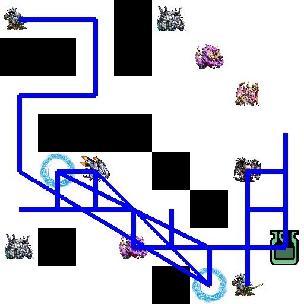
    


    Verbose: Displaying static maze maze_episode_final_88.jpg in Jupyter
    Verbose: Starting episode 89/100
    Verbose: Resetting environment
    Verbose: Episode 89 completed, total reward: 2, steps: 61
    Verbose: Generating static maze visualization as maze_episode_final_89.jpg
    Verbose: Static maze saved as maze_episode_final_89.jpg in /content
    


    
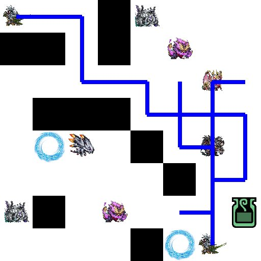
    


    Verbose: Displaying static maze maze_episode_final_89.jpg in Jupyter
    Verbose: Starting episode 90/100
    Verbose: Resetting environment
    Verbose: Episode 90 completed, total reward: 35, steps: 34
    Verbose: Generating static maze visualization as maze_episode_final_90.jpg
    Verbose: Static maze saved as maze_episode_final_90.jpg in /content
    


    
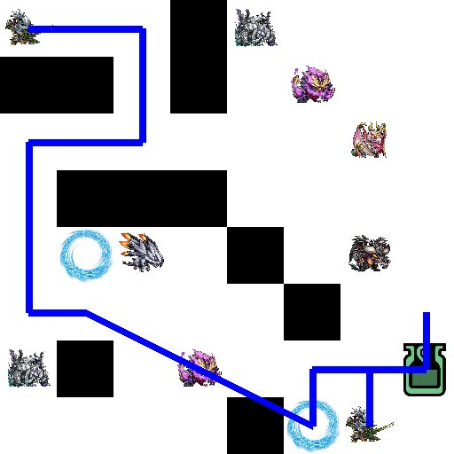
    


    Verbose: Displaying static maze maze_episode_final_90.jpg in Jupyter
    Verbose: Starting episode 91/100
    Verbose: Resetting environment
    Verbose: Episode 91 completed, total reward: 25, steps: 36
    Verbose: Generating static maze visualization as maze_episode_final_91.jpg
    Verbose: Static maze saved as maze_episode_final_91.jpg in /content
    


    
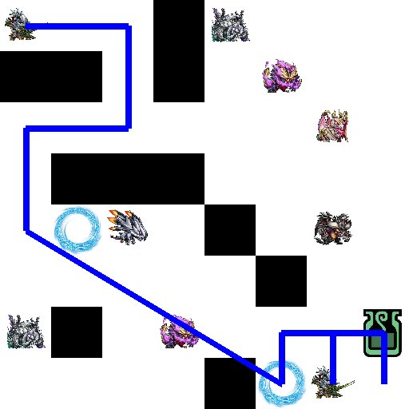
    


    Verbose: Displaying static maze maze_episode_final_91.jpg in Jupyter
    Verbose: Starting episode 92/100
    Verbose: Resetting environment
    Verbose: Episode 92 completed, total reward: 169, steps: 92
    Verbose: Generating static maze visualization as maze_episode_final_92.jpg
    Verbose: Static maze saved as maze_episode_final_92.jpg in /content
    


    

    


    Verbose: Displaying static maze maze_episode_final_92.jpg in Jupyter
    Verbose: Starting episode 93/100
    Verbose: Resetting environment
    Verbose: Episode 93 completed, total reward: 10, steps: 19
    Verbose: Generating static maze visualization as maze_episode_final_93.jpg
    Verbose: Static maze saved as maze_episode_final_93.jpg in /content
    


    

    


    Verbose: Displaying static maze maze_episode_final_93.jpg in Jupyter
    Verbose: Starting episode 94/100
    Verbose: Resetting environment
    Verbose: Episode 94 completed, total reward: 10, steps: 17
    Verbose: Generating static maze visualization as maze_episode_final_94.jpg
    Verbose: Static maze saved as maze_episode_final_94.jpg in /content
    


    

    


    Verbose: Displaying static maze maze_episode_final_94.jpg in Jupyter
    Verbose: Starting episode 95/100
    Verbose: Resetting environment
    Verbose: Episode 95 completed, total reward: 89, steps: 63
    Verbose: Generating static maze visualization as maze_episode_final_95.jpg
    Verbose: Static maze saved as maze_episode_final_95.jpg in /content
    


    
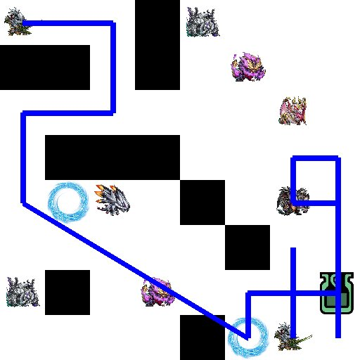
    


    Verbose: Displaying static maze maze_episode_final_95.jpg in Jupyter
    Verbose: Starting episode 96/100
    Verbose: Resetting environment
    Verbose: Episode 96 completed, total reward: 96, steps: 83
    Verbose: Generating static maze visualization as maze_episode_final_96.jpg
    Verbose: Static maze saved as maze_episode_final_96.jpg in /content
    


    
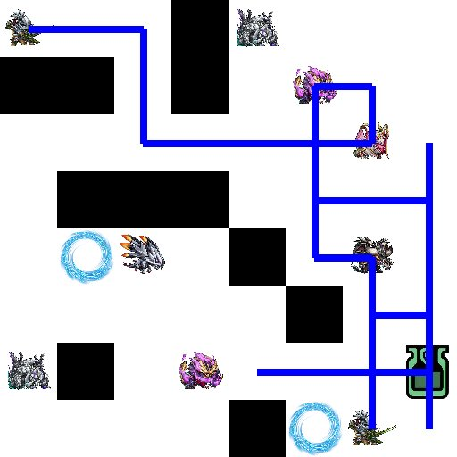
    


    Verbose: Displaying static maze maze_episode_final_96.jpg in Jupyter
    Verbose: Starting episode 97/100
    Verbose: Resetting environment
    Verbose: Episode 97 completed, total reward: 10, steps: 27
    Verbose: Generating static maze visualization as maze_episode_final_97.jpg
    Verbose: Static maze saved as maze_episode_final_97.jpg in /content
    


    

    


    Verbose: Displaying static maze maze_episode_final_97.jpg in Jupyter
    Verbose: Starting episode 98/100
    Verbose: Resetting environment
    Verbose: Episode 98 completed, total reward: 28, steps: 28
    Verbose: Generating static maze visualization as maze_episode_final_98.jpg
    Verbose: Static maze saved as maze_episode_final_98.jpg in /content
    


    
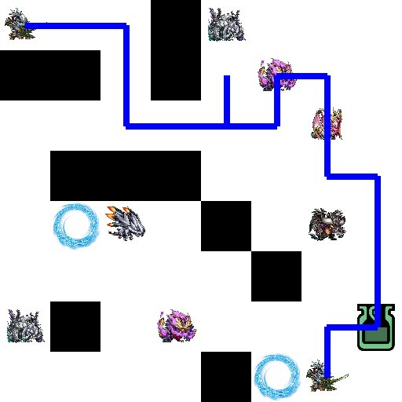
    


    Verbose: Displaying static maze maze_episode_final_98.jpg in Jupyter
    Verbose: Starting episode 99/100
    Verbose: Resetting environment
    Verbose: Episode 99 completed, total reward: 9, steps: 29
    Verbose: Generating static maze visualization as maze_episode_final_99.jpg
    Verbose: Static maze saved as maze_episode_final_99.jpg in /content
    


    
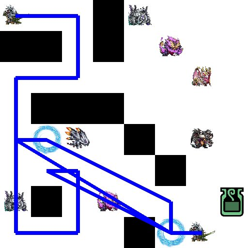
    


    Verbose: Displaying static maze maze_episode_final_99.jpg in Jupyter
    Verbose: Starting episode 100/100
    Verbose: Resetting environment
    Verbose: Episode 100 completed, total reward: 360, steps: 160
    Verbose: Generating static maze visualization as maze_episode_final_100.jpg
    Verbose: Static maze saved as maze_episode_final_100.jpg in /content
    


    
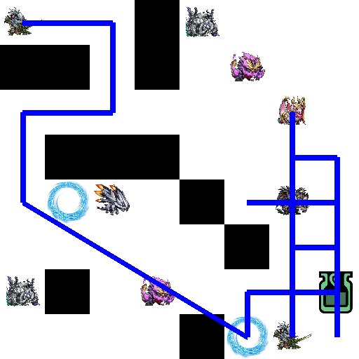
    


    Verbose: Displaying static maze maze_episode_final_100.jpg in Jupyter
    Verbose: Training completed
    Verbose: Starting manual testing mode
    Verbose: Resetting environment
    Manual testing started. Choose actions:
    Verbose: Generating static maze visualization as maze_manual_start.jpg
    Verbose: Static maze saved as maze_manual_start.jpg in /content
    


    

    


    Verbose: Displaying static maze maze_manual_start.jpg in Jupyter
    Enter action (0=Left, 1=Right, 2=Up, 3=Down, or -1 to exit):
    0
    Verbose: Moved to state 0, reward: 0, done: False
    Verbose: Generating static maze visualization as maze_manual_step_1.jpg
    Verbose: Static maze saved as maze_manual_step_1.jpg in /content
    


    
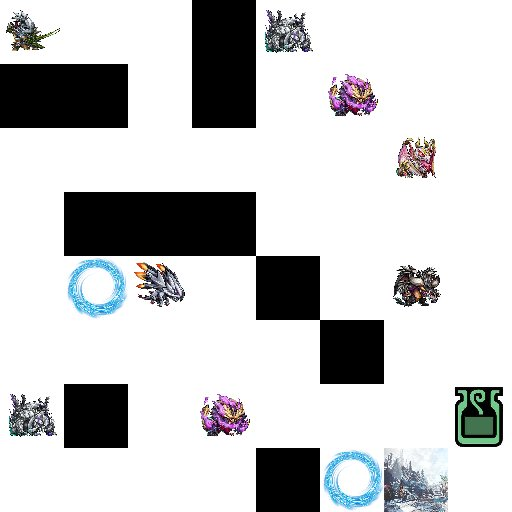
    


    Verbose: Displaying static maze maze_manual_step_1.jpg in Jupyter
    Enter action (0=Left, 1=Right, 2=Up, 3=Down, or -1 to exit):
    1
    Verbose: Moved to state 1, reward: 0, done: False
    Verbose: Generating static maze visualization as maze_manual_step_2.jpg
    Verbose: Static maze saved as maze_manual_step_2.jpg in /content
    


    
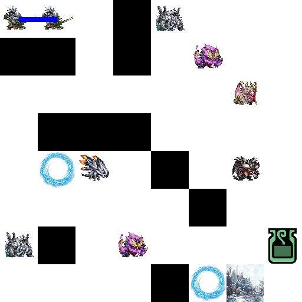
    


    Verbose: Displaying static maze maze_manual_step_2.jpg in Jupyter
    Enter action (0=Left, 1=Right, 2=Up, 3=Down, or -1 to exit):
    1
    Verbose: Moved to state 2, reward: 0, done: False
    Verbose: Generating static maze visualization as maze_manual_step_3.jpg
    Verbose: Static maze saved as maze_manual_step_3.jpg in /content
    


    
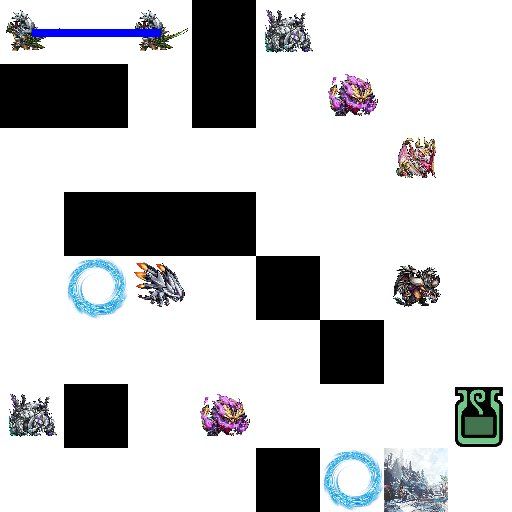
    


    Verbose: Displaying static maze maze_manual_step_3.jpg in Jupyter
    Enter action (0=Left, 1=Right, 2=Up, 3=Down, or -1 to exit):
    3
    Verbose: Moved to state 10, reward: 0, done: False
    Verbose: Generating static maze visualization as maze_manual_step_4.jpg
    Verbose: Static maze saved as maze_manual_step_4.jpg in /content
    


    
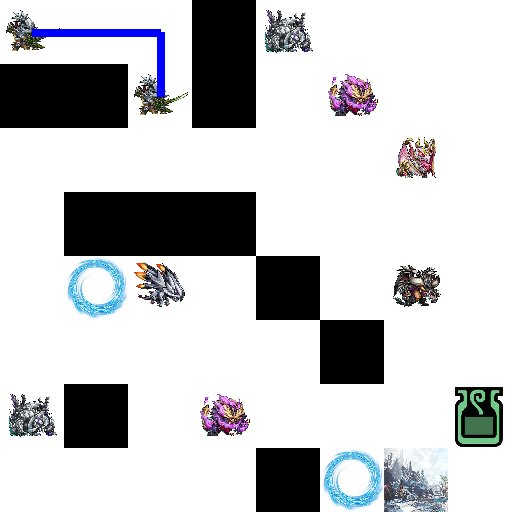
    


    Verbose: Displaying static maze maze_manual_step_4.jpg in Jupyter
    Enter action (0=Left, 1=Right, 2=Up, 3=Down, or -1 to exit):
    3
    Verbose: Moved to state 18, reward: 0, done: False
    Verbose: Generating static maze visualization as maze_manual_step_5.jpg
    Verbose: Static maze saved as maze_manual_step_5.jpg in /content
    


    
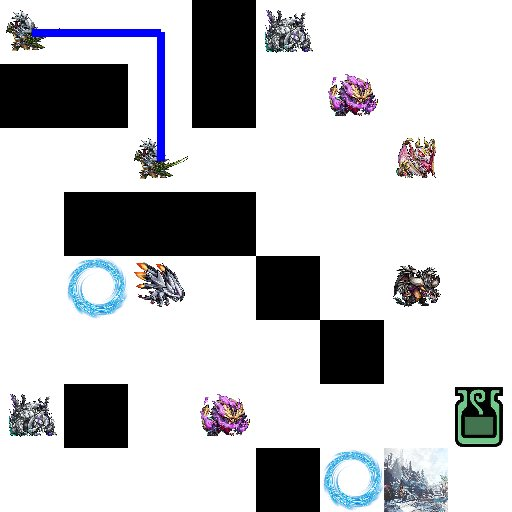
    


    Verbose: Displaying static maze maze_manual_step_5.jpg in Jupyter
    Enter action (0=Left, 1=Right, 2=Up, 3=Down, or -1 to exit):
    0
    Verbose: Moved to state 17, reward: 0, done: False
    Verbose: Generating static maze visualization as maze_manual_step_6.jpg
    Verbose: Static maze saved as maze_manual_step_6.jpg in /content
    


    

    


    Verbose: Displaying static maze maze_manual_step_6.jpg in Jupyter
    Enter action (0=Left, 1=Right, 2=Up, 3=Down, or -1 to exit):
    0
    Verbose: Moved to state 16, reward: 0, done: False
    Verbose: Generating static maze visualization as maze_manual_step_7.jpg
    Verbose: Static maze saved as maze_manual_step_7.jpg in /content
    


    

    


    Verbose: Displaying static maze maze_manual_step_7.jpg in Jupyter
    Enter action (0=Left, 1=Right, 2=Up, 3=Down, or -1 to exit):
    3
    Verbose: Moved to state 24, reward: 0, done: False
    Verbose: Generating static maze visualization as maze_manual_step_8.jpg
    Verbose: Static maze saved as maze_manual_step_8.jpg in /content
    


    

    


    Verbose: Displaying static maze maze_manual_step_8.jpg in Jupyter
    Enter action (0=Left, 1=Right, 2=Up, 3=Down, or -1 to exit):
    3
    Verbose: Moved to state 32, reward: 0, done: False
    Verbose: Generating static maze visualization as maze_manual_step_9.jpg
    Verbose: Static maze saved as maze_manual_step_9.jpg in /content
    


    

    


    Verbose: Displaying static maze maze_manual_step_9.jpg in Jupyter
    Enter action (0=Left, 1=Right, 2=Up, 3=Down, or -1 to exit):
    1
    Verbose: Moved to state 61, reward: 0, done: False
    Verbose: Generating static maze visualization as maze_manual_step_10.jpg
    Verbose: Static maze saved as maze_manual_step_10.jpg in /content
    


    

    


    Verbose: Displaying static maze maze_manual_step_10.jpg in Jupyter
    Enter action (0=Left, 1=Right, 2=Up, 3=Down, or -1 to exit):
    1
    Verbose: Moved to state 62, reward: 10, done: True
    Verbose: Generating static maze visualization as maze_manual_step_11.jpg
    Verbose: Static maze saved as maze_manual_step_11.jpg in /content
    


    
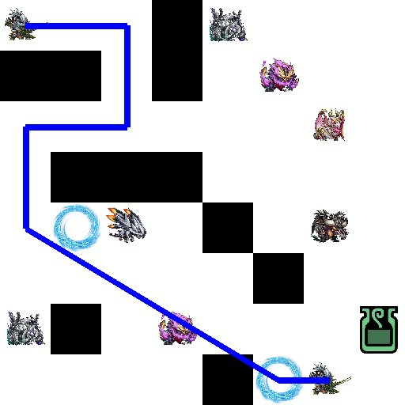
    


    Verbose: Displaying static maze maze_manual_step_11.jpg in Jupyter
    Verbose: Manual testing completed
    Verbose: Pygame quit
    

### Ref3: Visualize Epsilon Decay

The code below graphs the epsilon decay over the episodes, and the total rewards per episode.

Epsilon Decay: We can see that throughout 100 episodes, the epsilon started from 1, and gradually decreased as if in a straight line all the way to around 0.60, indicating that epsilon decay did take place.

Total Reward Per Episode: Additionally, we see how each episode performed. In the early episodes, the agent actually had a consistent low yield of reward, but later on, there were peaks which showed that it had runs where it got high rewards. Overall, the peak seemed to have occured around episodes 75-80.


```python
# Ref3: Visualize Epsilon Decay

plt.figure(figsize=(10, 8))
plt.subplot(2, 1, 1)
plt.plot(epsilons)
plt.title('Epsilon Decay Over Episodes')
plt.xlabel('Episode')
plt.ylabel('Epsilon')
plt.grid(True)

plt.subplot(2, 1, 2)
plt.plot(rewards)
plt.title('Total Reward Per Episode')
plt.xlabel('Episode')
plt.ylabel('Total Reward')
plt.grid(True)

plt.tight_layout()
plt.show()
```


    
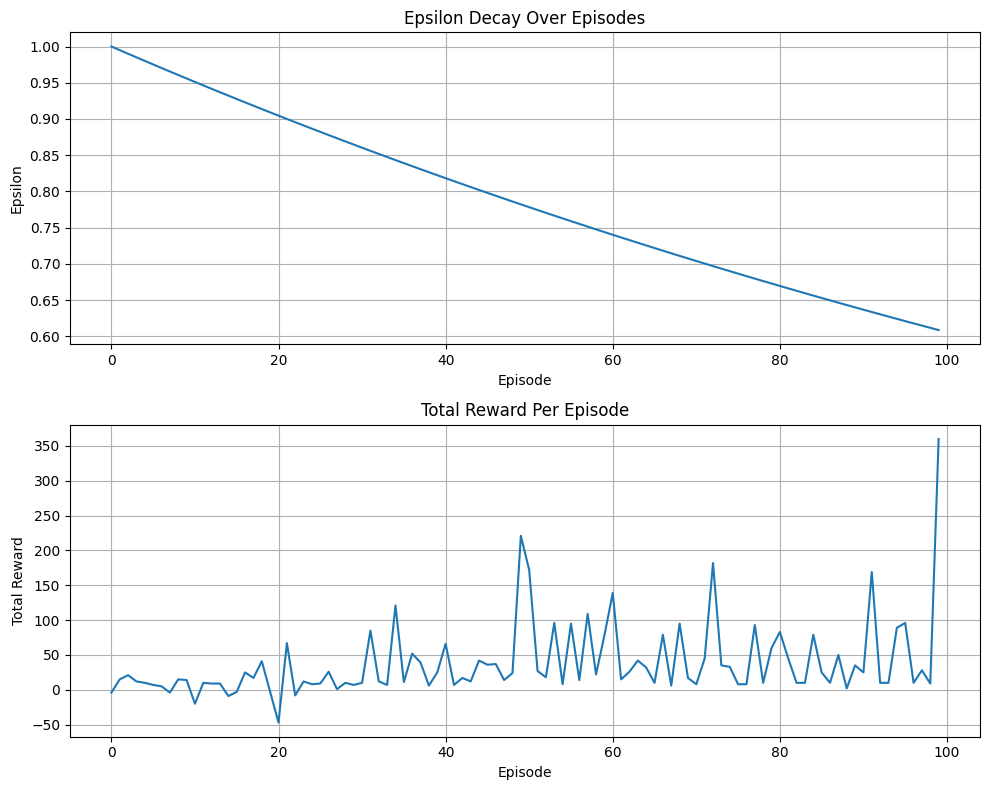
    


### Ref6: Generate a performance dashboard

This performance dashboard consists of 4 graphs.

Average Reward Per Episode - Similar to the total reward. There's a slow start early on, but a convergence in the later episodes, with the highest peak being around episode 75-80, showing that the model did actually improve over time/episodes.

Success Rate Over Episodes - Moving on to success rates, early on the agent actually performed badly, having a low cumulative success rate, but as the episodes went be, slowly but surely the success rate converged to above 70%, meaning it can perform better than average.

Episode Lengths - To better show the epsilon decay in action, episode lengths tells us how long each episode loop takes in terms of actions. In line with the epsilon decay, we see that the episodes later on got faster and faster, signifying that the model slowly adapted to exploitation later on, while mostly exploring early on.

Q-table Change Over Episodes - This graph shows how much the q-table was updated. A higher value just means that the q-table got more optimal steps added to it. We can actually see that in action around episodes 10-40 where there are a lot of changes, but interestingly around episode 75-80, a particular episode skyrocketed and had a high value. This can indicate that a lot more optimal actions have been found, updating the Q-table by a lot.


```python
# Ref6: Generate a performance dashboard with all plots in one figure
plt.figure(figsize=(15, 10))

# Graph Average Reward Per Episode
plt.subplot(2, 2, 1)
plt.plot(average_reward_per_episode)
plt.title('Average Reward Per Episode')
plt.xlabel('Episode')
plt.ylabel('Average Reward')

# Graph Success Rate Over Episodes
plt.subplot(2, 2, 2)
plt.plot(success_rate)
plt.title('Success Rate Over Episodes')
plt.xlabel('Episode')
plt.ylabel('Cumulative Success Rate')

# Graph Episode Lengths
plt.subplot(2, 2, 3)
plt.plot(episode_lengths)
plt.title('Episode Lengths Over Episodes')
plt.xlabel('Episode')
plt.ylabel('Steps')

# Graph Q-table Change Over Episodes
plt.subplot(2, 2, 4)
plt.plot(q_changes)
plt.title('Q-table Change (L2 Norm) Over Episodes')
plt.xlabel('Episode')
plt.ylabel('Change in Q-table')

plt.tight_layout()
plt.show()

```


    
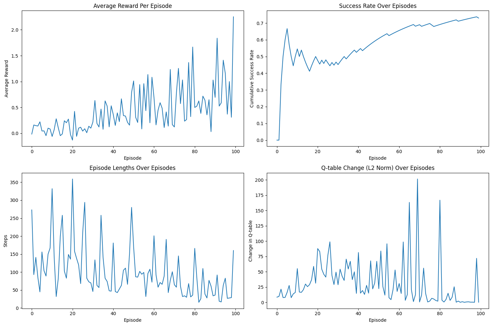
    


# Ref10: ACTION REPLAY

To see the replay in action, a simple call along with the action list done by the user is executed, showing the path the agent (user) took earlier.


```python
# Ref10: ACTION REPLAY
replay_maze(action_list)
```

    Verbose: Entering replay_maze function
    Verbose: Resetting environment
    Verbose: Starting replay...
    Verbose: Generating static maze visualization as maze_replay_start.jpg
    Verbose: Static maze saved as maze_replay_start.jpg in /content
    


    

    


    Verbose: Displaying static maze maze_replay_start.jpg in Jupyter
    Verbose: Generating static maze visualization as maze_replay_step_1.jpg
    Verbose: Static maze saved as maze_replay_step_1.jpg in /content
    


    

    


    Verbose: Displaying static maze maze_replay_step_1.jpg in Jupyter
    Verbose: Replay step 1, action: 0, state: 0, reward: 0, done: False
    Verbose: Generating static maze visualization as maze_replay_step_2.jpg
    Verbose: Static maze saved as maze_replay_step_2.jpg in /content
    


    

    


    Verbose: Displaying static maze maze_replay_step_2.jpg in Jupyter
    Verbose: Replay step 2, action: 1, state: 1, reward: 0, done: False
    Verbose: Generating static maze visualization as maze_replay_step_3.jpg
    Verbose: Static maze saved as maze_replay_step_3.jpg in /content
    


    

    


    Verbose: Displaying static maze maze_replay_step_3.jpg in Jupyter
    Verbose: Replay step 3, action: 1, state: 2, reward: 0, done: False
    Verbose: Generating static maze visualization as maze_replay_step_4.jpg
    Verbose: Static maze saved as maze_replay_step_4.jpg in /content
    


    

    


    Verbose: Displaying static maze maze_replay_step_4.jpg in Jupyter
    Verbose: Replay step 4, action: 3, state: 10, reward: 0, done: False
    Verbose: Generating static maze visualization as maze_replay_step_5.jpg
    Verbose: Static maze saved as maze_replay_step_5.jpg in /content
    


    

    


    Verbose: Displaying static maze maze_replay_step_5.jpg in Jupyter
    Verbose: Replay step 5, action: 3, state: 18, reward: 0, done: False
    Verbose: Generating static maze visualization as maze_replay_step_6.jpg
    Verbose: Static maze saved as maze_replay_step_6.jpg in /content
    


    
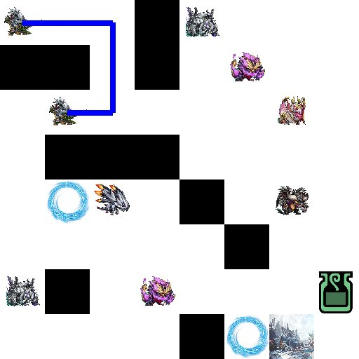
    


    Verbose: Displaying static maze maze_replay_step_6.jpg in Jupyter
    Verbose: Replay step 6, action: 0, state: 17, reward: 0, done: False
    Verbose: Generating static maze visualization as maze_replay_step_7.jpg
    Verbose: Static maze saved as maze_replay_step_7.jpg in /content
    


    
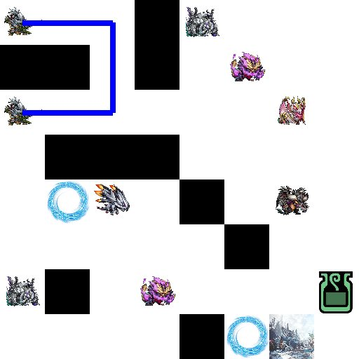
    


    Verbose: Displaying static maze maze_replay_step_7.jpg in Jupyter
    Verbose: Replay step 7, action: 0, state: 16, reward: 0, done: False
    Verbose: Generating static maze visualization as maze_replay_step_8.jpg
    Verbose: Static maze saved as maze_replay_step_8.jpg in /content
    


    
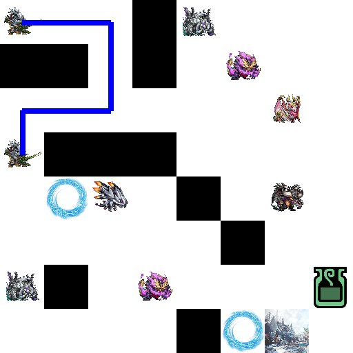
    


    Verbose: Displaying static maze maze_replay_step_8.jpg in Jupyter
    Verbose: Replay step 8, action: 3, state: 24, reward: 0, done: False
    Verbose: Generating static maze visualization as maze_replay_step_9.jpg
    Verbose: Static maze saved as maze_replay_step_9.jpg in /content
    


    
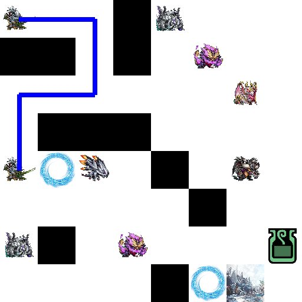
    


    Verbose: Displaying static maze maze_replay_step_9.jpg in Jupyter
    Verbose: Replay step 9, action: 3, state: 32, reward: 0, done: False
    Verbose: Generating static maze visualization as maze_replay_step_10.jpg
    Verbose: Static maze saved as maze_replay_step_10.jpg in /content
    


    
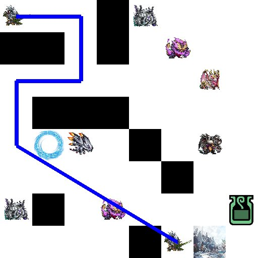
    


    Verbose: Displaying static maze maze_replay_step_10.jpg in Jupyter
    Verbose: Replay step 10, action: 1, state: 61, reward: 0, done: False
    Verbose: Generating static maze visualization as maze_replay_step_11.jpg
    Verbose: Static maze saved as maze_replay_step_11.jpg in /content
    


    

    


    Verbose: Displaying static maze maze_replay_step_11.jpg in Jupyter
    Verbose: Replay step 11, action: 1, state: 62, reward: 10, done: True
    Verbose: Replay completed.
    

# SUMMARY

The notebook implements a reinforcement learning algorithm of Q-learning within a custom 8x8 grid maze-like environment. It begins by importing necessary libraries like `pygame`, `numpy`, and `matplotlib`. The environment class, `MazeEnv`, features a grid with a start ('S'), goal ('G'), reward ('R'), walls ('W'), traps ('T'), and portals ('P1', 'P2').

The environment uses Pygame for visualization, loading custom images for different cell types and displaying the agent's path. This also sets up Q-learning parameters, including alpha, gamma, and epsilon with decay. The main function runs the training loop for a defined number of episodes, implementing the epsilon-greedy strategy for action selection and updating the Q-table.

During training, performance metrics such as average reward per episode, success rate, and episode length are tracked. After training, a manual testing mode allows users to interact with the environment using keyboard input. The user can also see their past actions with the `replay_maze` function, utilizing a saved list of actions from the manual test, visualizes the path taken during the manual interaction.

Finally, the notebook visualizes the training progress through various plots, including epsilon decay, total reward per episode, average reward per episode, success rate, episode lengths, and Q-table changes.
